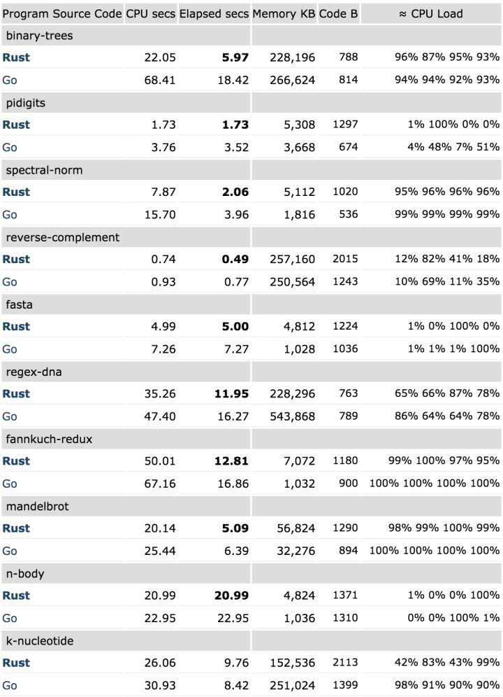
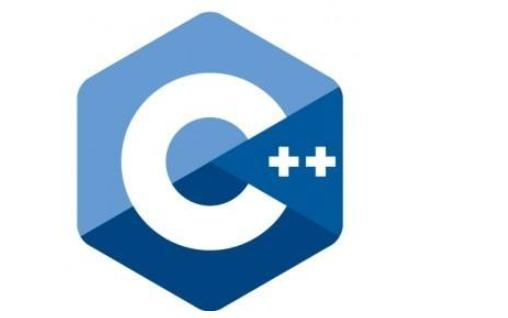

# Rust语言简介

## 缘起

Rust 语言最初只是 Mozilla 员工 Graydon Hoare 在 2006 年创建的一个业余项目。在 2010 年时，Mozilla 的研发团队在 Firefox 的开发过程中遇到了瓶颈。作为一个大型的自研浏览器项目，Firefox 底层实现主要用 C++ 编写。尽管团队拥有最佳的实践经验和丰富的工程技术人才，但是在编写浏览器内核这样拥有如此复杂的高性能、并行化和内存安全要求的代码时，仍然很容易出错。据统计，Firefox 中有超过 70% 的漏洞与内存安全有关。

正是在这种情况下，时任 Mozilla 工程师的 Graydon Hoare 毛遂自荐，掏出了自己捣鼓了 4 年的新语言 Rust 。在 JS 之父 Brendan Eich 和 Dave Herman 等人的帮助下，经过团队的进一步打磨，Rust 语言也从最初的个人项目变成一个日趋成熟的现代化编程语言。2012 年，Mozilla 正式宣布将推出基于 Rust 语言开发的新浏览器引擎 Servo，这是一个以内存安全性和并发性为首要原则而构建的浏览器引擎，同时也是 Rust 语言在一个完整大型项目中的首秀。

早期的 Rust 被 Graydon 描述为“寒武纪思想和狂野实验的碰撞”。秉持着“大力出奇迹”的思想，Graydon 从 C++、OCaml、Haskell、Erlang、ML、C＃、Ruby 等编程语言中吸取了大量的灵感，这些语言中的先进概念先后被加入 Rust 的特性中，这也反映了当时参与打磨 Rust 语言的工程师人数众多。尽管业内人士对 Mozilla 倾尽全力打造的这门雄心勃勃的新语言颇为赞赏，但当时的大多数人并不看好 Rust 这门新语言的发展前景。 

2015 年，Mozilla 发布了 Rust 的首个稳定版本 v1.0 ，成为 Rust 一个重要的里程碑。不久之后，Firefox 于 2016 年首次在生产环境中发布了第一个由 Rust 编写的组件。从这时起，Rust 开始在业内引起了广泛的注意，尤其是其特性中令人印象深刻的安全性。 

作为推出用来替代 C/C++ 的编程语言，Rust 与 C/C++ 的区别在于其强大的安全保障。除非通过使用“unsafe”关键字明确选择使用，否则 Rust 完全是内存安全的。在系统编程中，有时开发者必须执行无法静态验证为安全的操作。Rust 为开发者提供了将这些操作包装在安全抽象的工具中，这意味着 Rust 编译器可以静态地强制执行那些曾经属于代码注释或约定的操作。必须显式地标记内存不安全操作，从而极大地减少了内存安全漏洞出现的频率。
## 为什么要学习Rust？
这个我使用Rust官方的答案来回答各位看官。
### Performance 性能
Rust is blazingly fast and memory-efficient: with no runtime or garbage collector, it can power performance-critical services, run on embedded devices, and easily integrate with other languages.
Rust 速度惊人且内存利用率极高：无需运行时进行内存释放或者垃圾回收。由于没有垃圾回收，它能够胜任对性能要求特别高的服务，还可以在嵌入式设备上运行，并且能够轻松与其他语言集成。
### Reliability 高可靠性
Rust’s rich type system and ownership model guarantee memory-safety and thread-safety — enabling you to eliminate many classes of bugs at compile-time.
Rust丰富的类型系统和所有权模式保证了内存安全和线程安全--这些问题在编译的时候就被检查出来了。

### Productivity  生产力高
Rust has great documentation, a friendly compiler with useful error messages, and top-notch tooling — an integrated package manager and build tool, smart multi-editor support with auto-completion and type inspections, an auto-formatter, and more.
Rust有很好的文档，一个带有有用错误消息的友好编译器，以及一流的工具-一个集成的包管理器和构建工具，支持自动完成和类型检查的智能多编辑器，一个自动格式化程序，等等。【这些都保证了使用Rust开发的生产能力是很高的。】

### 网上找到的一个Go和Rust的性能评测

虽然Go和Rust其实的应用领域是完全不同的，最好是使用Rust和C++进行比较，不过那个比较我个人认为意义不大。因为可能性能差不多，目前还没有那种语言的运行速度可以超过C或者C++（汇编除外），基本都是无限接近。但是Rust是为了解决C++的内存泄露问题而开发的，这个才是Rust存在的意义所在。

知乎上有一篇文章[《微软到底看上 Rust 了没有？》](https://zhuanlan.zhihu.com/p/192431947),是大佬张汉东写的，大家可以看看。

还有这篇[微软计划以Rust替代C/C++？凭什么！](https://zhuanlan.zhihu.com/p/74357532),作者我不知道是谁，但分析的也非常好。

## Rust的特点

### Rust的特点之一就是内存安全
这个可能可能很多看官会有不同的意见，尤其是知道Rust有unsafe的使用的人。其实Rust已经说那个是unsafe了，你怎么还能指望编译器帮你解决安全问题啊？
其实Rust可以理解为两种语言safe Rust和unsafe Rust。这个就和go语言里面[cgo不是go](https://www.oschina.net/translate/cgo-is-not-go)一样,这完全是两码事。
还有说点题外话，很多大兄弟都知道C++难学，为什么哪？其实C++你可以理解为是包含四门子语言的语言结合体。

### 说点题外话，闲话C++
以下内容引用自[《将C++ 看作多种语言的联合体》](https://blog.csdn.net/armman/article/details/1616239)

最简单的办法就是把 C++ 看作一个有若干门语言组成的联合体，而不是一门单独的语言。在一个特定的子语言中，规则就显得简单、直接，而且不易忘记。当更换到另一门子语言时，规则就相应地改变了。为了理解 C++ ，必须认清 C++ 主要的子语言。幸运的是，主要的子语言只有四门：

#### C 
尽管变革是深刻的， C++ 仍然基于 C 语言。程序块、语句、预处理器、内建数据类型、数组、指针，等等。所有都来自于 C 。在许多情况下， C++ 可以比 C 更优雅地完成一些任务（预处理器的替代方法和使用对象管理资源），但是当我们发现正在使用“C++ 中的C” 这一部分编写程序时，高效编程原则就会反映出 C 语言的局限：没有模板、没有异常处理、没有重载，等等。

#### 面向对象的 C++
这一部分的 C++ 就是 “ 使用类的 C 语言 ” 的一切：类（包括构造器和析构器）、封装、继承、多态、虚函数（动态绑定），等等。这一部分的 C++ 是面向对象设计最为直接的应用，即类的规则。

#### 包含模板的 C++ 
这是 C++ 中泛型编程的一部分，大多数程序员在泛型编程领域涉足甚浅。模板的概念对 C++ 产生了深远的影响。模板如此之强大，它足以为我们带来了一个全新的编程范型：模板元编程 (template meta-programming, 简称 TMP) 。但是除非对模板到了痴迷的地步，大可不必投入过多精力。主流 C++ 编程很少涉及到 TMP 规则。

#### STL
显然地， STL 是一个模板库，但是它是一个非常特别的模板库。它的约定使得容器、迭代器、算法、函数对象完美地协同工作，当然模板和库也可以基于其它的理念来构建。 STL 有自己独特的解决问题的方法，当我们使用 STL 编程时，必须要遵循它的约定。

2021-02-20