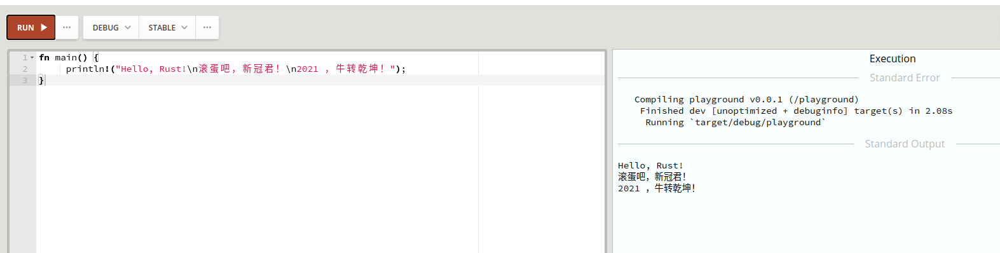

# Hello Rust 牛转乾坤！
[TOC]
由于2020年这个鼠年实在太背了，N年一遇的大疫情——新型冠状病毒肺炎（Corona Virus Disease 2019，COVID-19，简称<font color="red">“新冠肺炎”</font>）。

现在全世界人们都希望【牛转乾坤】，让疫情早早滚蛋吧。所以我在这里把大家习惯的Hello World。修改一下。

```rust
fn main() {
     println!("Hello, Rust!\n滚蛋吧，新冠君！\n2021 ，牛转乾坤！");
}
```

## 对了，忘记安装Rust环境了，Rust推荐的安装方式是两种

- On Unix, run curl https://sh.rustup.rs -sSf | sh in your shell. This downloads and runs rustup-init.sh, which in turn downloads and runs the correct version of the rustup-init executable for your platform.<br />
在类Unix下直接使用shell脚本安装
- On Windows, download and run rustup-init.exe.<br />
在Windows下使用安装程序进行安装。

## 环境配置
我是用的ubuntu 18.04，配置还是很简单的。

vim ~/.bashrc

```shell
PATH=$PATH::$HOME/.cargo/bin
```

这个时候执行一下 执行命令
```shell
 rustc --version
```

显示结果如下，说明安装成功了。

```shell
rustc 1.50.0 (cb75ad5db 2021-02-10)
```

## 编译

```shell
rustc  helloworld.rs -o helloworld 
```

## 执行

```shell
./helloworld
```

结果如下

```shell
Hello, Rust!
滚蛋吧，新冠君！
2021 ，牛转乾坤！
```

## 在[Rust Playground](https://play.rust-lang.org/)里面测试




2021-02-20