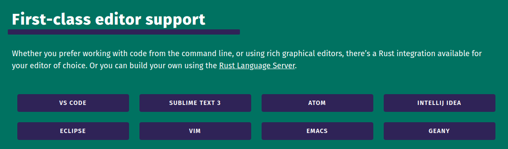
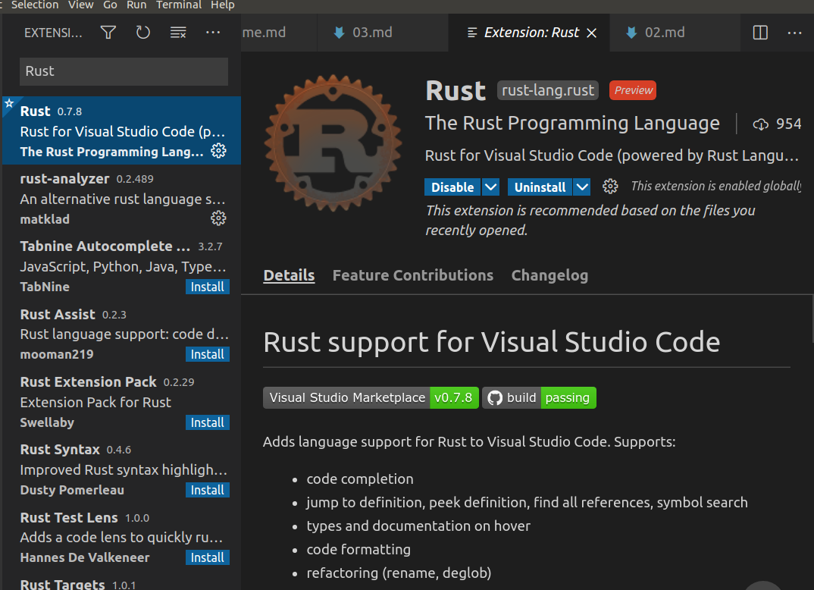

# Rust IDE简介

按照[Rust官方的推荐](https://www.rust-lang.org/tools)，建议使用的IDE有：[VS Code](https://marketplace.visualstudio.com/items?itemName=rust-lang.rust) 、[Atom](https://github.com/rust-lang/atom-ide-rust)、[Eclipse](https://www.eclipse.org/downloads/packages/release/2019-09/r/eclipse-ide-rust-developers-includes-incubating-components)、[SUBLIME TEXT 3](https://github.com/rust-lang/rust-enhanced)、[IntelliJ IDEA](https://plugins.jetbrains.com/plugin/8182-rust)、[Vim](https://github.com/rust-lang/rust.vim)、[Emacs](https://github.com/rust-lang/rust-mode)、[Geany](https://geany.org/about/filetypes/)

我个人推荐使用VS Code，这个目前来说是我使用的最便利的Rust IDE。

2021-02-22