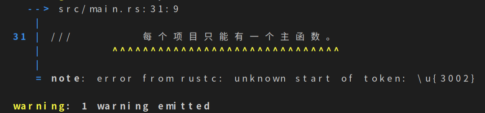
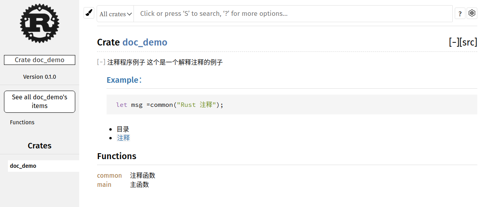
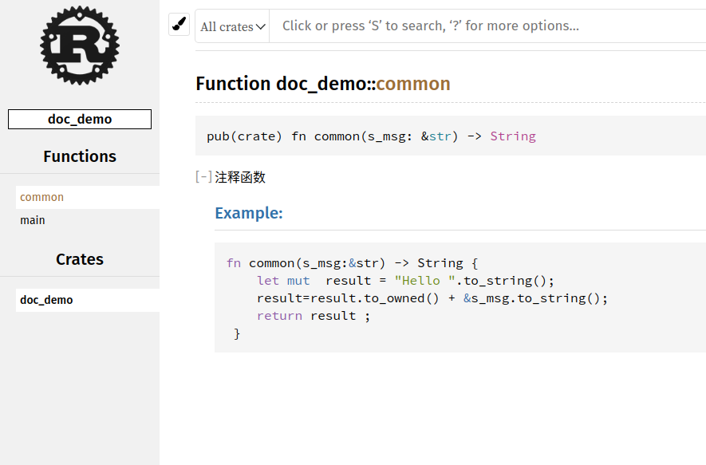
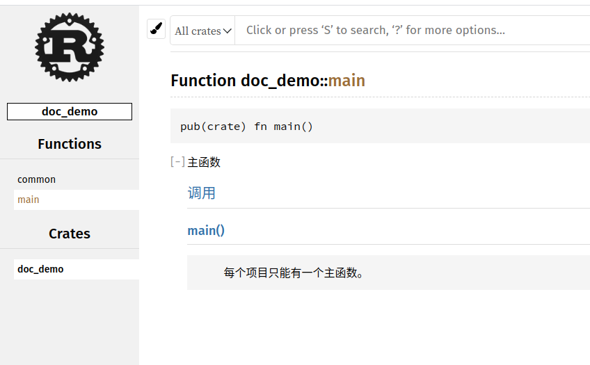
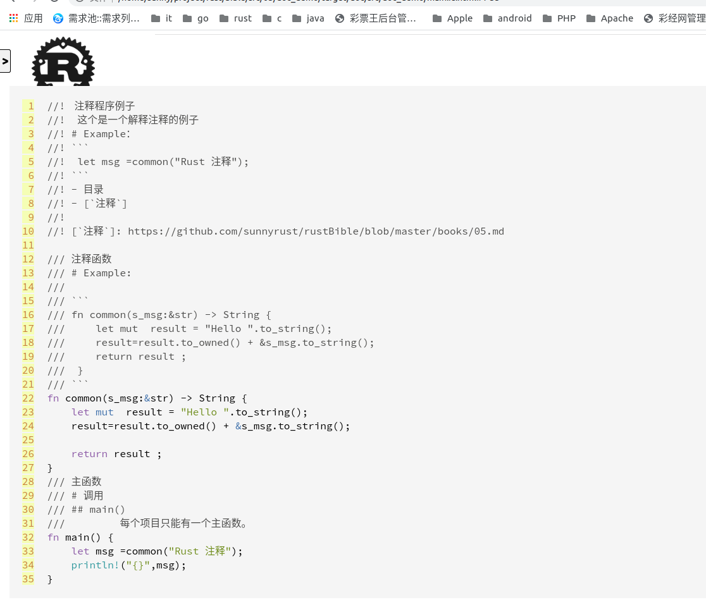

# 2.4 Rust 注释
[TOC]

对于任何一门语言注释都是非常重要的，尤其是现在，基本上你写好了注释，就可以直接生成API文档。本人是从Java开始享受这个自动生成文档的好处的，到后面的Go，以及现在的Rust。

所以本人非常重视注释，这个很多码农真的不怎么重视，甚至可以说轻视。但是，很多想法都是当时开发的时候感受最深的。过了一段时间在看原来的代码，你可能完全忘记当时是怎么想的。虽然，你可能编码规范很好，函数名、变量名也超级规范【这是另外一个议题，我会在别的章节单独讲解】，也难抵简单的记述来的更直观。

## 简单注释
Rust的注释使用两个<font color="blue">//</font>开始注释，然后空一格,注释一直持续到行尾，对于超出一行的注释，您需要在每一行中包含 //，就像这样：
```rust
// 第一行注释
// 第二行注释
// ……
// 第n行注释
// So we’re doing something complicated here, long enough that we need
// multiple lines of comments to do it! Whew! Hopefully, this comment will
// explain what’s going on.
```

## 简单块注释
Rust使用<font color="blue">/* */</font>进行块注释，这个是Rust兼容C/C++的块注释写法，但是 ***不推荐使用*** ，只有你认为这段注释不会使用在文档里面，你才可以说用。不过使用这种注释方式显得不是特别的 Rustaceans。

具体标注就像这样：

```rust
/*
 * 第一行注释
 * 第一行注释
 * ……
 * 第n行注释
 */
 
 /*
  * So we’re doing something complicated here, long enough that we need
  * multiple lines of comments to do it! Whew! Hopefully, this comment will
  * explain what’s going on. 
  */
```

## 文档注释——函数注释
Rust使用<font color="blue">///</font>进行文档注释，注释风格是Markdown风格。文档注释最好用Markdown语法编写。
例子看后面。


## 文档注释——crate、mod注释
Rust使用<font color="blue">//!</font>进行文档注释，注释风格是Markdown风格。文档注释最好用Markdown语法编写。
例子看后面。

## 生成文档
源程序：
```rust
//!  注释程序例子
//!  这个是一个解释注释的例子
//! # Example：
//! ```
//!  let msg =common("Rust 注释");
//! ```
//! - 目录
//! - [`注释`]
//!
//! [`注释`]: https://github.com/sunnyrust/rustBible/blob/master/books/05.md


/// 注释函数
/// # Example:
///
/// ```
/// fn common(s_msg:&str) -> String {
///     let mut  result = "Hello ".to_string();
///     result=result.to_owned() + &s_msg.to_string();
///     return result ;
///  }
/// ```
fn common(s_msg:&str) -> String {
    let mut  result = "Hello ".to_string();
    result=result.to_owned() + &s_msg.to_string();

    return result ;
}
/// 主函数 
/// # 调用
/// ## main()
///         每个项目只能有一个主函数。
fn main() {
    let msg =common("Rust 注释");
    println!("{}",msg);
}
```

```shell
$ cargo new doc_demo
     Created binary (application) `doc_demo` package
```
对中文支持不是很友好，我这个程序例子编译的时候会有warning。


生成的文档
```shell
$ tree
.
├── Cargo.lock
├── Cargo.toml
├── src
│   └── main.rs
└── target
    ├── CACHEDIR.TAG
    ├── debug
    │   ├── build
    │   ├── deps
    │   ├── examples
    │   └── incremental
    └── doc
        ├── ayu.css
        ├── brush.svg
        ├── COPYRIGHT.txt
        ├── dark.css
        ├── doc_demo
        │   ├── all.html
        │   ├── fn.common.html
        │   ├── fn.main.html
        │   ├── index.html
        │   └── sidebar-items.js
        ├── down-arrow.svg
        ├── favicon-16x16.png
        ├── favicon-32x32.png
        ├── favicon.svg
        ├── FiraSans-LICENSE.txt
        ├── FiraSans-Medium.woff
        ├── FiraSans-Regular.woff
        ├── LICENSE-APACHE.txt
        ├── LICENSE-MIT.txt
        ├── light.css
        ├── main.js
        ├── normalize.css
        ├── noscript.css
        ├── rustdoc.css
        ├── rust-logo.png
        ├── search-index.js
        ├── settings.css
        ├── settings.html
        ├── settings.js
        ├── SourceCodePro-LICENSE.txt
        ├── SourceCodePro-Regular.woff
        ├── SourceCodePro-Semibold.woff
        ├── source-files.js
        ├── source-script.js
        ├── SourceSerifPro-Bold.ttf.woff
        ├── SourceSerifPro-It.ttf.woff
        ├── SourceSerifPro-LICENSE.md
        ├── SourceSerifPro-Regular.ttf.woff
        ├── src
        │   └── doc_demo
        │       └── main.rs.html
        ├── storage.js
        ├── theme.js
        └── wheel.svg

11 directories, 45 files
```

生成的html文档见下图






总之，给你的代码编写Document ，写出富有表现力的名字、可读性高的文档；最好可以在注释里测试你的代码片段。

更多的信息，查看[原文](https://doc.rust-lang.org/book/ch14-02-publishing-to-crates-io.html#making-useful-documentation-comments)。


2021-02-23