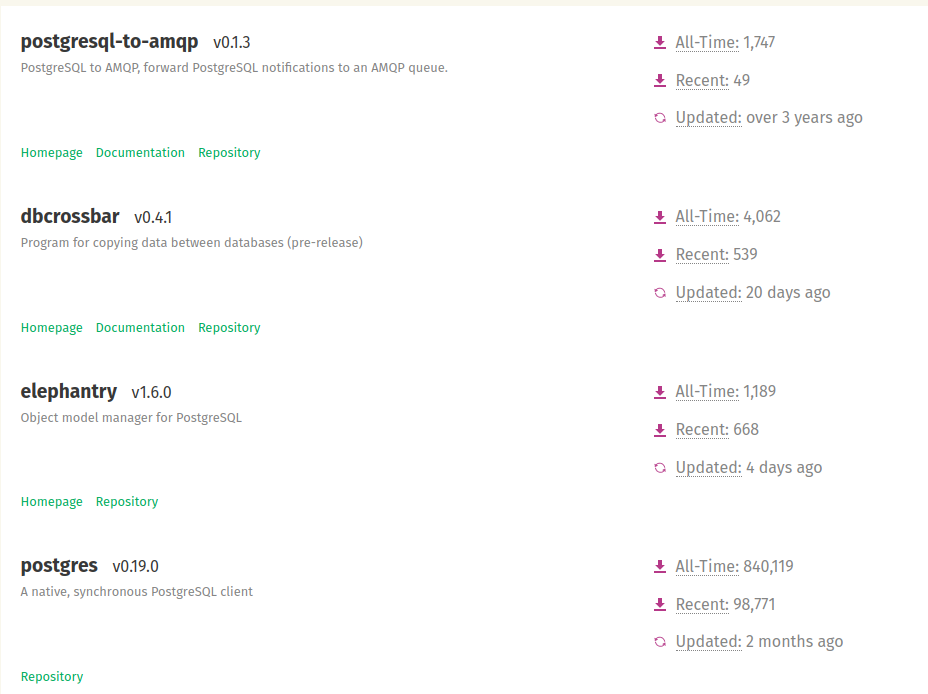

# 2.5 简单程序——我是一个锈菌
[TOC]
下面做一个简单的程序让我们体会一下Rust的有趣。

## 创建项目

```shell
$ cargo new says
$ cd says
```

The first command, cargo new, takes the name of the project (says) as the first argument. The second command changes to the new project’s directory.

第一条命令，使用cargo创建项目，名称是says。第二条命令是进入到这个项目的目录。

首先看一下Cargo.toml

```toml
[package]
name = "says"
version = "0.1.0"
authors = ["sunny <jinheking@gmail.com>"]
edition = "2018"

# See more keys and their definitions at https://doc.rust-lang.org/cargo/reference/manifest.html

[dependencies]
```

如果Cargo从你的环境中获得的作者信息不正确，请在文件中修正，然后再保存。

在[2.3 Hello, Cargo!](https://github.com/sunnyrust/rustBible/blob/master/books/04.md)这一节我们使用cargo生成了hello world程序，现在看一下cargo生成的程序：

```rust
fn main() {
    println!("Hello, world!");
}
```

运行一下

```shell
$ cargo run
   Compiling hello v0.1.0 (/home/sunny/project/rust/bible/src/01)
    Finished dev [unoptimized + debuginfo] target(s) in 0.30s
     Running `/home/sunny/project/rust/bible/src/05/target/debug/says`
Hello, world!
```

## 修改项目

### 引入ferris-says  crate

首先引入一个Crate[*注①](#注①)【有关crate的概念，我会在后面章节在详细讲解，因为crate和Trait是Rust里面比较独特的概念，我们后面慢慢聊。】—— ferris_says。

```toml
[dependencies]
ferris-says = "0.2"
```

这个时候执行命令
```shell
$ cargo install ferris-says
    Updating crates.io index
  Installing ferris-says v0.2.0
   Compiling libc v0.2.86
   Compiling autocfg v1.0.1
   Compiling adler v0.2.3
   Compiling bitflags v1.2.1
   Compiling gimli v0.23.0
   Compiling object v0.23.0
   Compiling unicode-width v0.1.8
   Compiling cfg-if v1.0.0
   Compiling rustc-demangle v0.1.18
   Compiling vec_map v0.8.2
   Compiling ansi_term v0.11.0
   Compiling strsim v0.8.0
   Compiling smallvec v0.4.5
   Compiling textwrap v0.11.0
   Compiling miniz_oxide v0.4.3
   Compiling atty v0.2.14
   Compiling clap v2.33.3
   Compiling addr2line v0.14.1
   Compiling backtrace v0.3.56
   Compiling error-chain v0.10.0
   Compiling ferris-says v0.2.0
    Finished release [optimized] target(s) in 9.79s
  Installing /home/sunny/.cargo/bin/fsays
   Installed package `ferris-says v0.2.0` (executable `fsays`)
```

执行下面命令

```shell
$ cargo build
```

也是一样的，都会把相关联的crate给下载下来。这个时候是不是体会到了cargo的强大和友好？

有关添加crate还有一个很好用的方法：
就是在项目的根目录(也就是Cargo.toml所在的目录)下执行下列命令
```shell
$ cargo add ferris-says
    Updating 'https://github.com/rust-lang/crates.io-index' index
      Adding ferris-says v0.2.0 to dependencies

```
cargo会默认把这个crate的相关版本都设置好，这个方便了我们。如果完全手工的话，一般的crate请去[crates.io](https://crates.io/)（*注②）这个网站查找相关的帮助和版本信息。

这个时候你会发现在Cargo.toml旁边会多出一个Cargo.lock文件

```shell
$ cat Cargo.lock 
# This file is automatically @generated by Cargo.
# It is not intended for manual editing.
[[package]]
name = "addr2line"
version = "0.14.1"
source = "registry+https://github.com/rust-lang/crates.io-index"
checksum = "a55f82cfe485775d02112886f4169bde0c5894d75e79ead7eafe7e40a25e45f7"
dependencies = [
 "gimli",
]

[[package]]
name = "adler"
version = "0.2.3"
source = "registry+https://github.com/rust-lang/crates.io-index"
checksum = "ee2a4ec343196209d6594e19543ae87a39f96d5534d7174822a3ad825dd6ed7e"

[[package]]
name = "ansi_term"
version = "0.11.0"
source = "registry+https://github.com/rust-lang/crates.io-index"
checksum = "ee49baf6cb617b853aa8d93bf420db2383fab46d314482ca2803b40d5fde979b"
dependencies = [
 "winapi",
]

[[package]]
name = "atty"
version = "0.2.14"
source = "registry+https://github.com/rust-lang/crates.io-index"
checksum = "d9b39be18770d11421cdb1b9947a45dd3f37e93092cbf377614828a319d5fee8"
dependencies = [
 "hermit-abi",
 "libc",
 "winapi",
]

[[package]]
name = "autocfg"
version = "1.0.1"
source = "registry+https://github.com/rust-lang/crates.io-index"
checksum = "cdb031dd78e28731d87d56cc8ffef4a8f36ca26c38fe2de700543e627f8a464a"

[[package]]
name = "backtrace"
version = "0.3.56"
source = "registry+https://github.com/rust-lang/crates.io-index"
checksum = "9d117600f438b1707d4e4ae15d3595657288f8235a0eb593e80ecc98ab34e1bc"
dependencies = [
 "addr2line",
 "cfg-if",
 "libc",
 "miniz_oxide",
 "object",
 "rustc-demangle",
]

[[package]]
name = "bitflags"
version = "1.2.1"
source = "registry+https://github.com/rust-lang/crates.io-index"
checksum = "cf1de2fe8c75bc145a2f577add951f8134889b4795d47466a54a5c846d691693"

[[package]]
name = "cfg-if"
version = "1.0.0"
source = "registry+https://github.com/rust-lang/crates.io-index"
checksum = "baf1de4339761588bc0619e3cbc0120ee582ebb74b53b4efbf79117bd2da40fd"

[[package]]
name = "clap"
version = "2.33.3"
………………
```
这个文件就是把所有和ferris-says v0.2.0 相关的crate都关联起来。

### 修改main.rs
把main.rs修改一下
```rust
use ferris_says::say; // 这个依赖前面的一步
use std::io::{stdout, BufWriter};

fn main() {
    let stdout = stdout();
    let message = String::from("I'm a  Rustaceans!");
    let width = message.chars().count();

    let mut writer = BufWriter::new(stdout.lock());
    say(message.as_bytes(), width, &mut writer).unwrap();
}

```

运行一下：

```shell
$ cargo run -q
 ____________________
< I'm a  Rustaceans! >
 --------------------
        \
         \
            _~^~^~_
        \) /  o o  \ (/
          '_   -   _'
          / '-----' \
```

感觉相当好，是不是大兄弟们？

## 再次优化项目

### 首先把共用的ferris 提成一个函数

```rust
/// 用于使用ferris_says显示内容
fn says(msg:&str){
    let stdout = stdout();
    let message = String::from(msg);
    let width = message.chars().count();

    let mut writer = BufWriter::new(stdout.lock());
    say(message.as_bytes(), width, &mut writer).unwrap();
}
```
### 修改main函数
引用官方文档推荐的猜数游戏，这里只引用了第一步，有兴趣的大兄弟可以去网站看后续，[地址](https://doc.rust-lang.org/book/ch02-00-guessing-game-tutorial.html)。
```rust
fn main() {
    says("I'm a  Rustaceans!");
    println!("Guess the number!");

    println!("Please input your guess.");

    let mut guess = String::new();

    io::stdin()
        .read_line(&mut guess)
        .expect("Failed to read line");

    let msg=format!("You guessed: {}", guess);
    says(msg.as_str());
}
```

各位大兄弟们，这一章的简单介绍Rust到此就结束了，从下一章开始，我们就开始啃枯燥的语法了。语法虽然枯燥，但是那是基础。


- <a id="注①">注①</a>crate 是一个二进制项或者库。crate root 是一个源文件，Rust 编译器以它为起始点，并构成你的 crate 的根模块。包（package） 是提供一系列功能的一个或者多个 crate。一个包会包含有一个 Cargo.toml 文件，阐述如何去构建这些 crate。

- <a id="注②">注②</a>crates.io里面可以方便的查找你需要的各种类库，比如你想操作PostgreSQL，不知道应该引用哪一个crate，去哪里搜索，会出现一个列表，里面有很多选择，个人建议采用下载最多的。然后你点下去，会找到你所需要的各种帮助：文档、源码github地址等。

2021-02-24