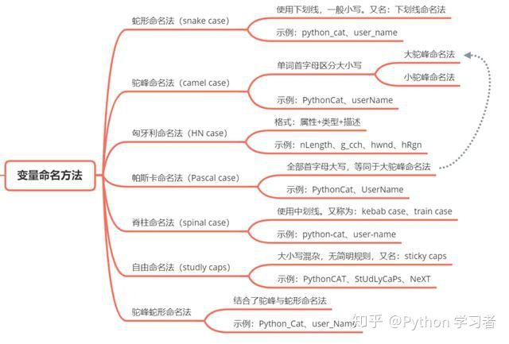

# 3.1 Rust的常见编程概念.

[TOC]

本章涵盖了几乎所有编程语言中出现的概念和最基本的常识，以及它们在Rust中的工作方式。许多编程语言的核心都有很多共同点。本章介绍的概念都不是Rust所独有的，但我们将在Rust的环境中讨论它们，并围绕这些概念解释如何使用。

具体来说，您将学习变量、基本类型、函数、注释和控制流。这些基础概念将存在于每个 Rust 程序中，及早学习它们将使你以最快的速度学习 Rust 的使用；尽早学会它们将是你一往无前。


## 介绍println！

在正式开始介绍基本概念前，我们先介绍一个最有用的<font color="blue">【宏】</font>,注意，我这里使用的是<font color="blue">【宏】——macros</font>而不是<font color="blue">【函数】——function</font>。在Rust里面会大量使用宏语句，[标准库的宏](https://doc.rust-lang.org/std/index.html#macros)在这里查询。

还是从最简单的程序开始：

```shell
$ cargo new sunny_println
     Created binary (application) `sunny_println` package
$ cd sunny_printl
$ cargo run -q
Hello, world!
```

打开main.rs看一下：
```rust
fn main() {
    println!("Hello, world!");
}
```
里面只有一条语句，  println!("Hello, world!");

现在我们给这条语句加上注解。

```rust
fn main() {
    // Rust 每条语句都要使用；作为结尾
    // println! 这种以!结尾的是宏语句调用，在Rust里面有大量的宏语句
    println!("换行输出!");  // 换行输出内容

    print!("不换行");            // 不换行输出

    print!("换行输出\n");  // 换行输出

    println!("测试println的{}。","功能");   // 传递参数的方式
}
```
这个宏虽然很有用，但是简单的使用就是上面，看看这个宏的源码

```rust
/// println!(); // prints just a newline
/// println!("hello there!");
/// println!("format {} arguments", "some");
/// ```
#[macro_export]
#[stable(feature = "rust1", since = "1.0.0")]
#[allow_internal_unstable(print_internals, format_args_nl)]
macro_rules! println {
    () => ($crate::print!("\n"));
    ($($arg:tt)*) => ({
        $crate::io::_print($crate::format_args_nl!($($arg)*));
    })
}
```


下面我来做一个支持无限参数的println

```rust
macro_rules! to_placeholder {
    ($x: expr) => {
        "{}"
    }
}

macro_rules! sunny_print {
    ($first: expr $(, $x: expr)* $(,)?) => {
        println!(concat!("{}", $(" ", to_placeholder!($x)), *), $first, $($x), *)
    }
}

fn main() {
    sunny_print!(1);
    sunny_print!(1, 2);
    sunny_print!(1, "test");
    sunny_print!(1, "test", 3);
}
```

有了这碗println!酒垫底，我们就可以去Rust里面闯关了。


## Rust命名规则

纵观各种Like C的语言都有自己的各种命名规则，我的原则是有命名规则强于没有命名规则。 命名的风格能让我们在不需要去查找类型声明的条件下快速地了解某个名字代表的含义: 类型, 变量, 函数, 常量, 宏, 等等, 甚至. 我们大脑中的模式匹配引擎非常依赖这些命名规则.

命名规则（[*注①](#注①)）主要有这么几类：

|命名方法|解释|样例|
|:--|:--|:--|
|小驼峰(lowerCamelCase)|首字母小写的驼峰命名法。又称"帕斯卡拼写法"（PascalCase）|intAge(年龄int类型)|
|大驼峰(UpperCamelCase)|首字母大写的驼峰命名法|IntAge(年龄int类型)|
|蛇形命名法(snake case)([*注②](#注②))|用下划线将单词连接起来的命名法|int_age(年龄int类型)|
|中横线命名法，也称为脊柱命名法（spinal-case 、kebab-case、Train-Case、Lisp-case|用中横线将单词连接起来的命名法|int-age(年龄int类型)|
|蛇形驼峰命名法(snake_Came_case)|蛇形驼峰命名法|Int_Age(年龄int类型|


[Rust官方命名规则](https://rust-lang.github.io/api-guidelines/naming.html)


- 注① : 在历史上，"骆驼拼写法"早就存在。苏格兰人的姓名中的Mac前缀就是一例，比如著名歌手Paul MacCartney的名字中，M和C都是大写的，如果将C小写就是错误的。另一个例子是，著名化学品公司杜邦公司的名字DuPont。<br />但是，这种拼写法真正流行，还是在80年代以后，那时正是计算机语言开始兴起的时候。许多著名的计算机语言依靠单词不同的大小写来区分变量。在计算机语言中，还有一种"匈牙利拼写法"（Hungarian Type Notation），变量中每个单词的首字母都大写，然后变量名的最前面再加一个小写字母，表示这个单词的数据类型。比如，iMyTestValue这个变量名，就表示它是一个整数变量（integer）。据说，微软公司最喜欢使用"匈牙利拼写法"。

- 注② : Rust采用蛇形命名法。

2021-02-24