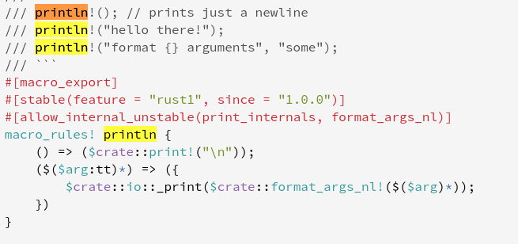

# 3.1 Rust的常见编程概念
[TOC]

本章涵盖了几乎所有编程语言中出现的概念和最基本的常识，以及它们在Rust中的工作方式。许多编程语言的核心都有很多共同点。本章介绍的概念都不是Rust所独有的，但我们将在Rust的环境中讨论它们，并围绕这些概念解释如何使用。

具体来说，您将学习变量、基本类型、函数、注释和控制流。这些基础概念将存在于每个 Rust 程序中，及早学习它们将使你以最快的速度学习 Rust 的使用；尽早学会它们将是你一往无前。


## 介绍println！

在正式开始介绍基本概念前，我们先介绍一个最有用的<font color="blue">【宏】</font>,注意，我这里使用的是<font color="blue">【宏】——macros</font>而不是<font color="blue">【函数】——function</font>。在Rust里面会大量使用宏语句，[标准库的宏](https://doc.rust-lang.org/std/index.html#macros)在这里查询。

还是从最简单的程序开始：

```shell
$ cargo new sunny_println
     Created binary (application) `sunny_println` package
$ cd sunny_printl
$ cargo run -q
Hello, world!
```

打开main.rs看一下：
```rust
fn main() {
    println!("Hello, world!");
}
```
里面只有一条语句，  println!("Hello, world!");

现在我们给这条语句加上注解。

```rust
fn main() {
    // Rust 每条语句都要使用；作为结尾
    // println! 这种以!结尾的是宏语句调用，在Rust里面有大量的宏语句
    println!("换行输出!");  // 换行输出内容

    print!("不换行");            // 不换行输出

    print!("换行输出\n");  // 换行输出

    println!("测试println的{}。","功能");   // 传递参数的方式
}
```
这个宏虽然很有用，但是简单的使用就是上面，看看这个宏的源码

```rust
/// println!(); // prints just a newline
/// println!("hello there!");
/// println!("format {} arguments", "some");
/// ```
#[macro_export]
#[stable(feature = "rust1", since = "1.0.0")]
#[allow_internal_unstable(print_internals, format_args_nl)]
macro_rules! println {
    () => ($crate::print!("\n"));
    ($($arg:tt)*) => ({
        $crate::io::_print($crate::format_args_nl!($($arg)*));
    })
}
```



下面我来做一个支持无限参数的println

```rust
macro_rules! to_placeholder {
    ($x: expr) => {
        "{}"
    }
}

macro_rules! sunny_print {
    ($first: expr $(, $x: expr)* $(,)?) => {
        println!(concat!("{}", $(" ", to_placeholder!($x)), *), $first, $($x), *)
    }
}

fn main() {
    sunny_print!(1);
    sunny_print!(1, 2);
    sunny_print!(1, "test");
    sunny_print!(1, "test", 3);
}
```
2021-02-24