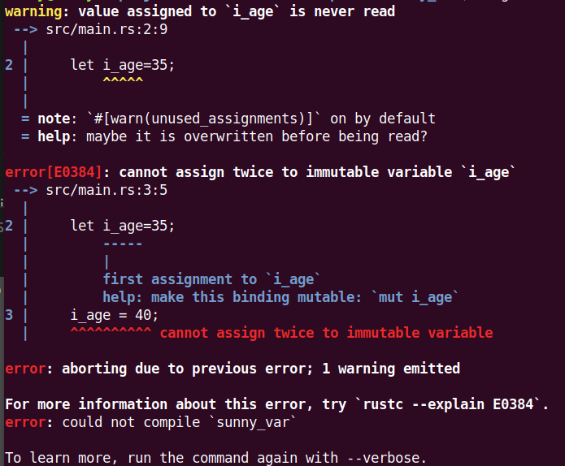
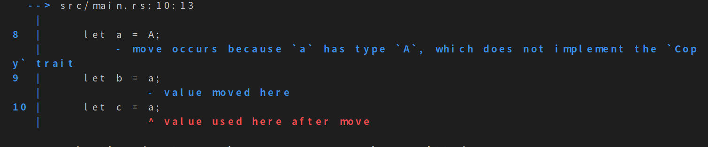
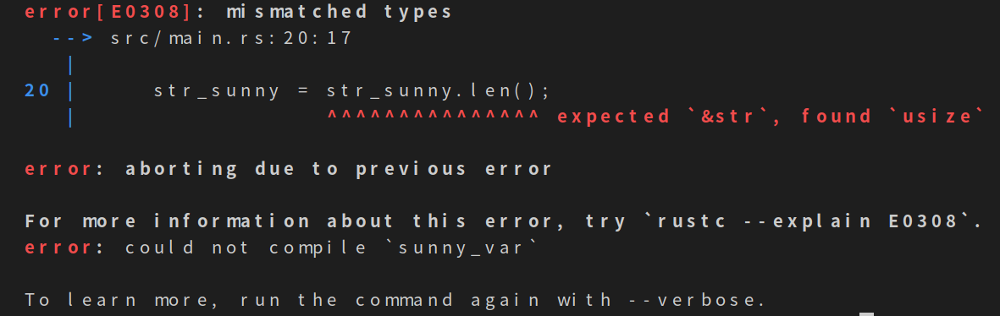
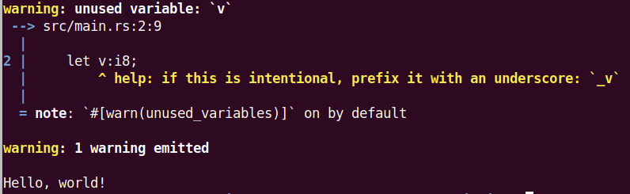
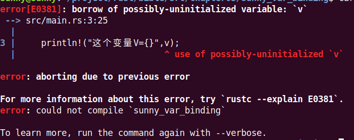

#  3.2 变量和可变性

[TOC]

## 变量

首先必须说明，Rust 是强类型语言，但具有自动判断变量类型的能力。这很容易让人与弱类型语言产生混淆。

如果要声明变量，需要使用 let 关键字。例如：

```rust
let i_age=35;
```

这个时候对这个变量修改值：

```rust
let i_age=35;

i_age = 40;
```
运行结果


查看一下错误码E0384的解释
```shell
$ cargo --explain E0384
An immutable variable was reassigned.

Erroneous code example:


fn main() {
    let x = 3;
    x = 5; // error, reassignment of immutable variable
}

By default, variables in Rust are immutable. To fix this error, add the keyword
`mut` after the keyword `let` when declaring the variable. For example:


fn main() {
    let mut x = 3;
    x = 5;
}
```

上面的解释还是很详细的。从这个例子就引出了Rust的最重要的一个概念

## 变量绑定(Variable bindings)
对于一般的语言 x=123;这样的样式都是赋值，但是对于Rust来说这是绑定。使用let把某些值绑定给某个变量。

let关键字用于绑定表达式。我们可以将一个名字绑定到一个值或一个函数上。另外，由于let表达式的左侧是一个 "模式(pattern)"[注①](#注①)，所以可以将多个名字绑定到一组值或函数值上。

```rust
let (x, y) = (1, 2); // x = 1 and y = 2

let z = {
    let x = 3;
    let y = 6;

    x + y
}; // z = 9
```

## 变量的可变性

上面的例子的解释里面看到了Rust如果不加<font color="blue">mut</font>,编译器会提示<font color="red">cannot assign twice to immutable variable</font>,翻译过来就是【不能对不可变的变量进行二次赋值】。

这个就是Rust很牛的地方，一般的语言都是默认可变的，甚至有些语言从来就没有这个不可变的概念。但是Rust使用默认不可变，这个就是Rust设计的初衷就是安全，而Rust解决安全的方法就是在编译的时候解决所有可能的安全问题。增加<font color="blue">mut</font>标签就是为了在编译的时候处理这些变量是否可变的问题。

下面再看一个例子：

```rust
struct A;
fn main() {
    let a = A;
    let b = a;
    let c = a;
}
```
运行结果


原因是A这个值已经被转移(move)到了b，导致这个值不能再付给c。

简单解决：

```rust
let a = A;
    let b = &a;   // 这个是没有进行权利转移
    let c = a;      //  要是这两句进行上下换一下位置还是会出现上面的错误。
```

还有一个解决方法

```rust
#[derive(Clone, Copy)]
struct A;
fn main() {
    let a = A;
    let b = a;   
    let c = a;    
}
```
这样编译也是可以过去的，这是由于增加了A的Copy实现，就从有移动(move)语义变成了有复制(copy)语义，所以现在代码的编译。

在这里我要提一下后面要提到的一个重要概念——泛型。如果你使用一个泛型，它默认具有移动语义，除非你指定实现Copy。在你希望复制值的情况下，你也可能希望使用Clone来代替，因为它更通用（所有实现Copy的类型都会实现Clone）。你不要担心克隆与复制的效率问题，除非类型的编写者明确地去做（谁会这么干哪？），否则克隆和复制在优化后的表现是一样的。[*注②](#注②)
## 重影（Shadowing）
重影的概念与其他面向对象语言里的"重写"（Override）或"重载"（Overload）是不一样的。重影就是指变量的名称可以被重新使用的机制：

```rust
fn main() {
    let v = 8;
    let v = v* 10;
    let v = v + 1;
    println!("The value of v is: {}", v);
}
```
结果

    The value of v is: 81

这个就是Rust与其它语言很大的不同，虽然变量名一样，但是每次let的v都是完全不同的变量，当每次值被其它变量绑定以后，这个原来的变量就失效了。


用下面的例子可能会看起来更明显：

```rust
    let v:i16 = 8;
    let v:&str =  "hello";
    let v:f64 = 0.618;
    println!("The value of v is: {}", v);
```

结果：

    The value of v is: 0.618

这次可以看到，三次的V的类型都不同,这个对与编译语言是不可能出现的，同一个变量会是不一样的类型。

可能是设计时出于安全考虑不想让程序员使用很多不同类型的变量名，造成程序的混乱和复杂，它允许你在语法上声明使用新变量的同时把原来的变量给干掉 。这意味着在程序内不会出现两个同名的变量，后来的会把之前的干掉。


重影与可变变量的赋值不是一个概念，重影是指用同一个名字重新代表另一个变量实体，其类型、可变属性和值都可以变化。但可变变量赋值仅能发生值的变化。

```rust
    let str_sunny = "Hello World";
    println!("str_sunny={}", str_sunny);
    let str_sunny = str_sunny.len();
    println!("str_sunny={}", str_sunny);
```
这样是可以编译过的。

```rust
    let mut str_sunny = "Hello World";
    println!("str_sunny={}", str_sunny);
    str_sunny = str_sunny.len();
    println!("str_sunny={}", str_sunny);
```
这个时候就编译不过去，出现一个E0308的错误，这个就是改变了同一个变量的类型。



## 初始化绑定（Initializing bindings）

Rust 变量绑定有另一个不同于其它语言的地方：绑定要求在可以使用它之前必须初始化。

看下面的程序
```rust
fn main() {
    let v:i8;
    println!("Hello, world!");
}
```
这个程序编译是没有红色的<font color="red">error</font>,但是却有黄色的<strong style= "background:black"><font color="yellow">warning</font></strong>。顺便提一句，Rust建议没有用到的变量使用<font color="blue">_</font>开头，或者在这一行的上面加上<font color="blue">#[warn(unused_variables)]</font>。




Rust 警告我们从未使用过这个变量绑定，但是因为我们从未用过它,所以也不会产生严重的后果。但是如果你使用了，问题就会暴露。

```rust
fn main() {
    let v:i8;
    println!("这个变量V={}",v);
}
```


看一下编译器给的解决方案：
```shell
$ cargo --explain E0381


It is not allowed to use or capture an uninitialized variable.

Erroneous code example:


fn main() {
    let x: i32;
    let y = x; // error, use of possibly-uninitialized variable
}

To fix this, ensure that any declared variables are initialized before being
used. Example:

fn main() {
    let x: i32 = 0;
    let y = x; // ok!
}


```

Rust编译器就是这样严格，Rust 是不会让我们使用一个没有经过初始化的值的，这个会引起内存的问题。


- <a id="注①">注①</a>:模式这个概念很独特，我们在后面会专门讲解这个问题。

- <a id="注②">注②</a>：Copy是marker trait，告诉编译器需要move的时候copy。Clone表示拷贝语义，有函数体。不正确的实现Clone可能会导致Copy出BUG。

2021-02-26


