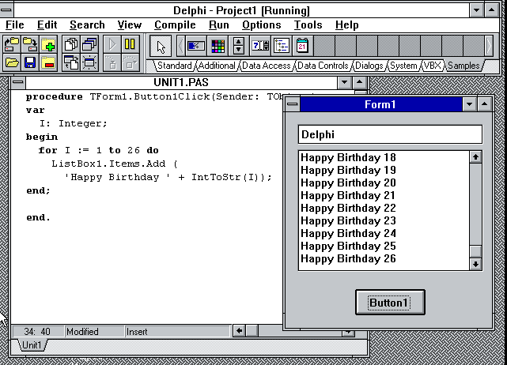
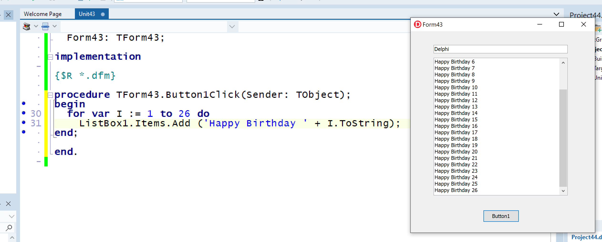

# 3.3 数据类型(Data Types)

[TOC]

这章我们讲一下Rust的数据类型。

## 整数型(Integer)
整数是一个没有小数部分的数字。具体到Rust有很多种整数类型,按照bit长度和是否有符号可以分为一下几类：


|Length|Signed|Unsigned|
|:--|:--|:--|
|8-bit|i8|u8|
|16-bit|i16|u16|
 |32-bit|i32|u32|
 |64-bit|i64|u64|
 |128-bit|i128|u128|
 |arch|isize|usize|

isize 和 usize 两种整数类型是用来衡量数据大小的，它们的位长度取决于所运行的目标平台，如果是 32 位架构的处理器将使用 32 位位长度整型。

整数的表述方法有以下几种：
|进制|样例|
|--|--|
|十进制|	98_222|
|十六进制|	0xff|
|八进制|	0o77|
|二进制|	0b1111_0000|
|字节(只能表示 u8 型)|	b'A'|

有的整数中间存在一个下划线，这种设计可以让人们在输入一个很大的数字时更容易判断数字的值大概是多少。就如同58,123中间的，。

### 例子
今天正好是Delphi26岁的生日，网上有很多的[纪念文章](https://blogs.embarcadero.com/26-years-of-delphi/)。我在这里也纪念一下它，使用我的方式。

先看看Delphi当年的样例：


现在的样子


我也写一个一模一样的例子来纪念。虽然把后面的循环提前展示了一点，不过没有关系，这里只是简单提及，后面会详细讲。

```shell
$ cargo new delphi26
     Created binary (application) `delphi26` package
$ cd delphi26
```

```rust
fn main() {
    for i in 1..27 {
        println!("Happy Birthday {}",i);
    }
}
```
这个就是一个简单的循环，看看整数的循环。

下面的例子，让我真切感受一下Integer：

```shell
$ cargo new sunny_integer
     Created binary (application) `sunny_integer` package
```

```rust
fn main() {
    println!("The smallest i8 is {} and the biggest i8 is {}.", std::i8::MIN, std::i8::MAX); // hint: printing std::i8::MIN means "print MIN inside of the i8 section in the standard library"
    println!("The smallest u8 is {} and the biggest u8 is {}.", std::u8::MIN, std::u8::MAX);
    println!("The smallest i16 is {} and the biggest i16 is {}.", std::i16::MIN, std::i16::MAX);
    println!("The smallest u16 is {} and the biggest u16 is {}.", std::u16::MIN, std::u16::MAX);
    println!("The smallest i32 is {} and the biggest i32 is {}.", std::i32::MIN, std::i32::MAX);
    println!("The smallest u32 is {} and the biggest u32 is {}.", std::u32::MIN, std::u32::MAX);
    println!("The smallest i64 is {} and the biggest i64 is {}.", std::i64::MIN, std::i64::MAX);
    println!("The smallest u64 is {} and the biggest u64 is {}.", std::u64::MIN, std::u64::MAX);
    println!("The smallest i128 is {} and the biggest i128 is {}.", std::i128::MIN, std::i128::MAX);
    println!("The smallest u128 is {} and the biggest u128 is {}.", std::u128::MIN, std::u128::MAX);
}
```

运行结果：

```shell
$ cargo run -q
The smallest i8 is -128 and the biggest i8 is 127.
The smallest u8 is 0 and the biggest u8 is 255.
The smallest i16 is -32768 and the biggest i16 is 32767.
The smallest u16 is 0 and the biggest u16 is 65535.
The smallest i32 is -2147483648 and the biggest i32 is 2147483647.
The smallest u32 is 0 and the biggest u32 is 4294967295.
The smallest i64 is -9223372036854775808 and the biggest i64 is 9223372036854775807.
The smallest u64 is 0 and the biggest u64 is 18446744073709551615.
The smallest i128 is -170141183460469231731687303715884105728 and the biggest i128 is 170141183460469231731687303715884105727.
The smallest u128 is 0 and the biggest u128 is 340282366920938463463374607431768211455.
```

## 浮点型(Float)

2021-02-25