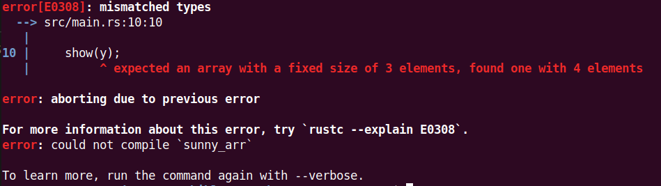

# 3.4 复合型数据类型

[TOC]

## 数组 array
Rust的数组是被表示为[T;N]。其中N表示数组大小，并且这个大小一定是个编译时就能获得的整数值，T表示泛型类型，即任意类型。我们可以这么来声明和使用一个数组:

```rust
let arr = [1, 2, 3, 4, 5];
let months = ["January", "February", "March", "April", "May", "June", "July","August", "September", "October", "November", "December"];
```

Rust的数组中的N（大小）也是类型的一部分，即[u8; 3] != [u8; 4]。这么设计是为了更安全和高效的使用内存，像这样：

```rust
let arr: [i32; 5] = [1, 2, 3, 4, 5];
```

但是如果使用不正确，就会编译出错：

```rust
fn show(arr: [u8;3]) {
    for i in &arr {
        print!("{} ", i);
    }
}
fn main() {
    let x: [u8; 3] = [1, 2, 3];
    show(x);
    let y: [u8; 4] = [1, 2, 3, 4];
    show(y);
}
```

编译就会出错误:


## 切片（Slices）
一个切片（slice）是一个数组的引用（或者“视图”）。它有利于安全，有效的访问数组的一部分而不用进行拷贝。比如，你可能只想要引用读入到内存的文件中的一行。原理上，片段并不是直接创建的，而是引用一个已经存在的变量。片段有预定义的长度，可以是可变也可以是不可变的。

切片这个名字往往出现在生物课上，我们做样本玻片的时候要从生物体上获取切片，以供在显微镜上观察。在 Rust 中，切片的意思大致也是这样，只不过它从数据取材引用。

最常见的切片是String Slice，因为这里还没有讲解String，所以这个技术点留在后面再讲。

```rust
let arr = [0,1, 2, 3, 4, 5, 6];
let slice_complete = &arr[..]; // 获取全部元素
let slice_middle = &arr[1..5]; // 获取中间元素，最后取得的Slice为 [1,2, 3, 4] 。切片遵循左闭右开原则。
let slice_right = &arr[1..]; // 最后获得的元素为[1,2, 3, 4, 5, 6]，长度为6。
let slice_left = &arr[..3]; // 最后获得的元素为[0,1, 2]，长度为3。
```

现在对上面编译不过去的程序进行修改：

```rust
fn show(arr: &[u8]) {
    for i in arr {
        print!("{} ", i);
    }
    println!("");
}
fn main() {
    let x: [u8; 3] = [1, 2, 3];
    let x_slice=&x[..];
    show(x_slice);
    let y: [u8; 4] = [1, 2, 3, 4];
    show(&y[..]);
}
```

运行

```shell
$ cargo run -q
1 2 3 
1 2 3 4 
```

## 元祖(Tuples)

在 Rust 中，元组（tuples）是固定大小的有序列表，这个和别的语言没有什么区别。元组是一种通用的方式，它将一些具有不同类型的值组合成一个复合类型。元组有一个固定的长度：一旦声明，它们就不能增加或缩小。

我们通过在括号内写一个逗号分隔的值列表来创建一个元组。元组中的每个位置都有一个类型，而且元组中不同值的类型不必相同。如下：

```rust
let tup_sunny: (&str, i32, &str)=("Sunny",46,"Rustaceans");
let (name, age, job) = tup_sunny;
println!("{},{} years old, he's a {}.",name, age, job);

```
输出

    Sunny,46 years old, he's a Rustaceans

在变量那一节，我们提过let是模式，比普通的赋值要强大的多。在上面的例子里面，let这个模式，如果它能匹配右侧的话，我们可以一次写多个绑定。这种情况下，let“解构”或“拆开”了元组，并分成了三个绑定。


今天是元宵节，我再用元宵节秀一个元祖的例子：

```rust
    let tup = ("🍡🍡🍡","2021-02-26", "元宵节","Sunny","节日快乐！","🎉🎉🎉");
    println!("{} {},今天是{},{}祝所有的Rustaceans{} {}",tup.0, tup.1, tup.2, tup.3, tup.4, tup.5);
```
就像数组索引，它从0开始，不过也不像数组索引，它使用.，而不是[]。

运行结果：

    🍡🍡🍡 2021-02-26,今天是元宵节,Sunny祝所有的Rustaceans节日快乐！ 🎉🎉🎉

2021-02-26（元宵节）