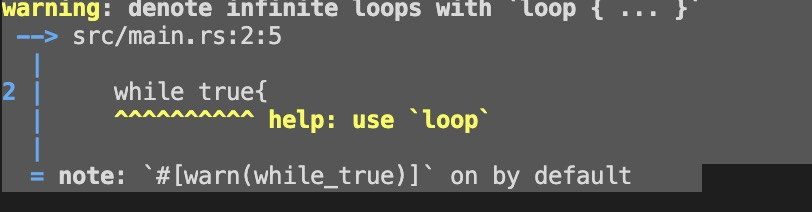

# while

[TOC]

while 是另外的一种循环写法，对于之前使用习惯了Go语言的，其实对loop、while都已经很陌生了，for是Go里面唯一的循环语句。本人其实很赞同Go的做法，不过作为一本语法书📚，我还是要介绍的。


```rust
fn main() {
    let a = [10, 20, 30, 40, 50];
    let mut index = 0;

    while index < 5 {
        println!("the value is: {}", a[index]);

        index += 1;
    }
}
```
代码从索引0开始，然后循环，直到到达数组中的最后一个索引（也就是说，当索引<5不再是真时）。运行这段代码将打印数组中的每个元素。运行结果如下：
```shell
$ cargo run -q
the value is: 10
the value is: 20
the value is: 30
the value is: 40
the value is: 50
```
所有五个数组的值都出现在终端中，正如预期的那样。尽管index会在某个时刻达到5的值，但在尝试从数组中获取第六个值之前，循环停止执行。

但这种方法容易出错，如果索引长度不正确，可能会导致程序奔溃。它的速度也很慢，因为编译器在每次循环迭代时都会添加运行时代码来对每个元素进行条件检查。

## 不要使用`while true`这种写法

```rust
while true{

}
```

这种写法是一个`warning`，错误提示如下:

```shell
warning: denote infinite loops with `loop { ... }`
 --> src/main.rs:2:5
  |
  |     while true{
  |     ^^^^^^^^^^ help: use `loop`
  |
  = note: `#[warn(while_true)]` on by default
```



2021-03-27