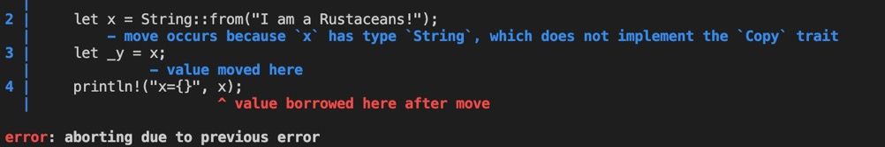
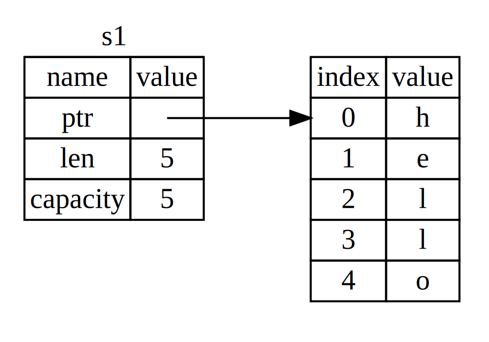
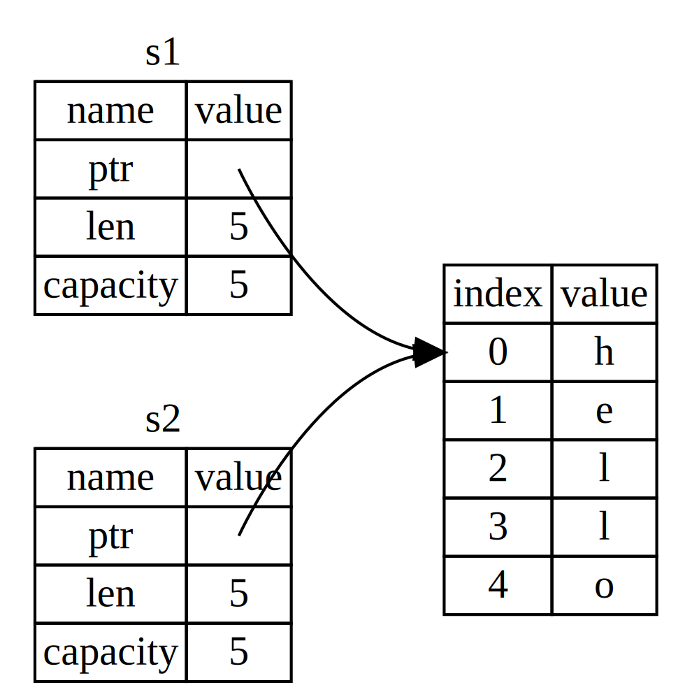
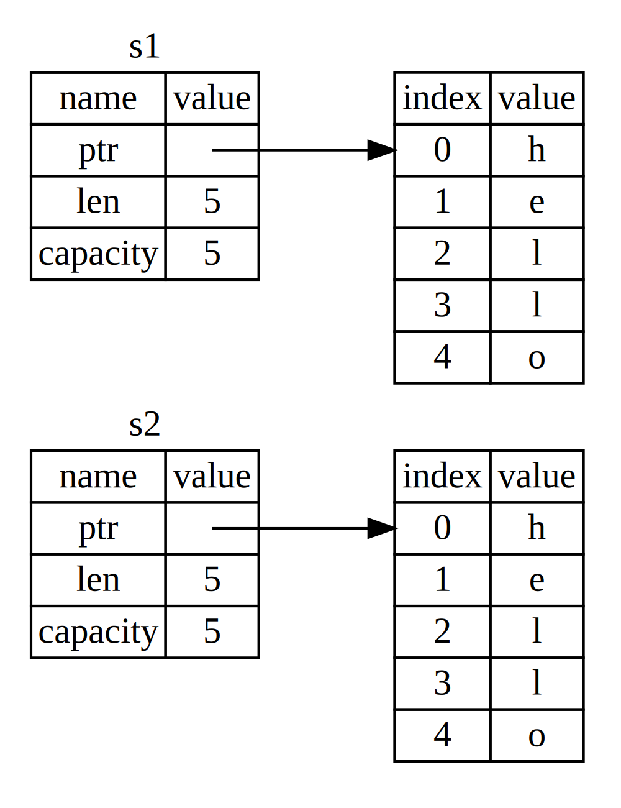
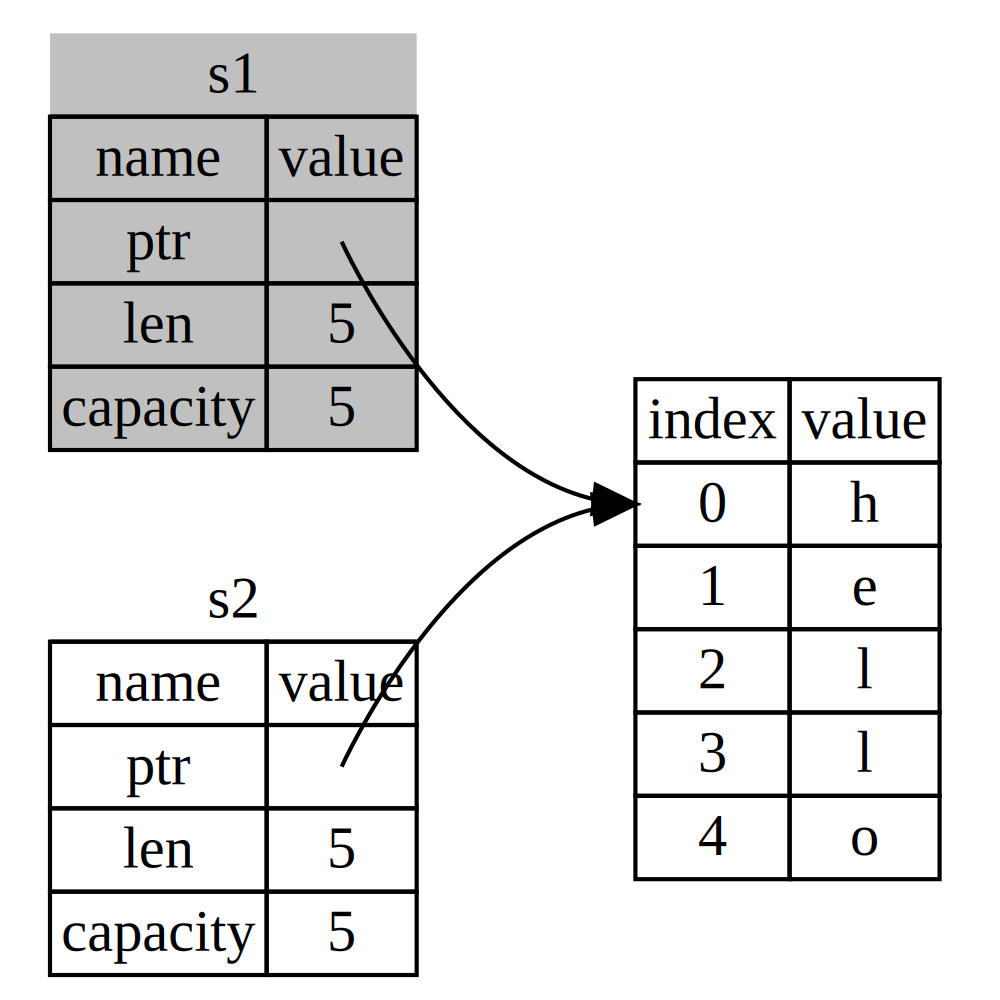

# 所有权(ownership)
[TOC]

所有权是Rust编程语言提供的独特功能,可在不使用垃圾收集器或指针的情况下提供内存安全保障。虽然这个特征很容易解释，但它对语言的其他部分有很深的影响。

## 什么是所有权
所有的程序在运行时都必须管理它们使用计算机内存的方式。

- 有些语言有垃圾回收功能，在程序运行时不断寻找不再使用的内存，并进行回收，比如：Java和Go；

- 在其他语言中，程序员必须显式地分配和释放内存。比如：C和C++

- Rust使用了第三种方法：内存是通过所有权系统管理的，它有一套规则，编译器在编译时检查。所有权特性不会在程序运行时减慢程序的速度。


因为所有权对于很多程序员来说是一个新概念，确实需要一些时间来适应。好消息是，你对Rust和所有权系统的规则越有经验，你就越能自然而然地开发出安全高效的代码。继续努力吧!

当你理解了所有权，你就会有一个坚实的基础来理解使Rust独特的特性。

## 所有权规则

- Rust中的每一个值都有一个变量，这个变量被称为它的所有者。
  
- 同一时间只能有一个所有者。

- 当所有者超出范围时，与其相关联的值将被销毁。
  

## 变量的可变范围

我们来看看一些变量的范围，范围是指程序中某项有效的范围。假设我们有一个变量，它看起来像这样：

```rust
let sunny_str = "I am a Rustaceans!";
```
变量sunny_str指的是一个字符串文字，字符串的值被硬编码到我们的程序文本中。变量从它被声明到当前作用域结束都是有效的.

如果稍微改变一下：

```rust
{                                          // sunny_str在这里还没有被定义
    let sunny_str = "I am a Rustaceans!";  // sunny_str被定义
    ………… // do smthing
}                                          // sunny_str在这里失效
```

这个就是变量的可用范围。换句话说，这里有两个重要的时间点：

- 当sunny_str范围内时，它是有效的。

- 在sunny_str退出范围之前，它一直是有效的。


```rust
let x = 6;
println!("x={}", x);
let x = String::from("I am a Rustaceans!🍇");
println!("x={}", x);
```

这个就是x在再次被绑定以后，之前的变量范围就结束了。

## 所有权的转移

Rust的所有权还有一个重要的概念，就是所有权的转移。在 Rust 中，多个变量可以以不同的方式与相同的数据交互。比如下例：
```rust
let s1= String::from("I am a Rustaceans!🍇");
let _s2 = s1;
println!("s1={}", s1);
```
编译就会提示下面的错误



> 这里明确说了x的值已经被转移了，还提示是因为String没有实现`Copy`这个特性。


为什么String的值转移了就原来的变量绑定就不存在了哪？看着String和整形很相似啊？其实不是，一个String由三部分组成，如下图所示：一个指向存放字符串内容的内存的指针、一个长度和一个容量。这组数据存储在堆上。右边是堆上存放内容的内存。


长度是指String的内容当前使用了多少内存，以字节为单位。容量是指String从分配器获得的内存总量，以字节为单位。长度和容量之间的区别很重要，但在这个上下文中并不重要，所以现在可以忽略容量。

当我们将s1分配给s2时，String数据被复制，这意味着我们复制了堆栈上的指针、长度和容量。我们不复制指针所指的堆上的数据。换句话说，数据在内存中的表示方式如下图所示：


表示方式并不像下图那样，如果Rust反而把堆上的数据也复制了，那么内存就是这样的。如果Rust这样做，如果堆上的数据很大，那么s2 = s1这个操作在运行时的性能上会非常大。


如果你在使用其他语言的时候听过浅层拷贝和深层拷贝这两个名词，那么在不复制数据的情况下复制指针、长度和容量的概念可能听起来就像是在做浅层拷贝。但因为Rust也会使第一个变量无效，所以不叫浅层复制，而叫移动。在这个例子中，我们会说s1被移到了s2中。所以实际发生的情况如下图所示：


这下就解决了我们的疑惑!为什么只有s2是有效的。除此之外，这其中还隐含了一个设计选择。Rust永远不会自动创建数据的 "深度 "副本。因此，任何自动复制都可以被认为在运行时性能方面是廉价的。

但是Rust中也有例外

## 复制特征(Copy trait)
如果变量是整形就不会有这个问题，如下：

```rust
let x = 6;
let _y = x;
println!("x={}", x);
```

因为整形默认实现了`Copy`这个特性。还有哪些默认实现了这个特性哪？

- 所有整数类型，如u32。
- 布尔类型-bool，其值为true或false。
- 所有浮动类型，如f64。
- 字符类型，如char。
- 元祖如果元素都是支持了Copy 特性的，这个元祖也支持，如果有支持的这个元祖也不支持. 如(i32, i32) 可以, 但是(i32, String) 不可以.


## Rust 三大铁律

1. Rust 中的每一个值都有一个被称为其 所有者（owner）的变量。

2. 值有且只有一个所有者。

3. 当所有者（变量）离开作用域，这个值将被丢弃。


## 参考

1. [RUST语言的编程范式](https://coolshell.cn/articles/20845.html)