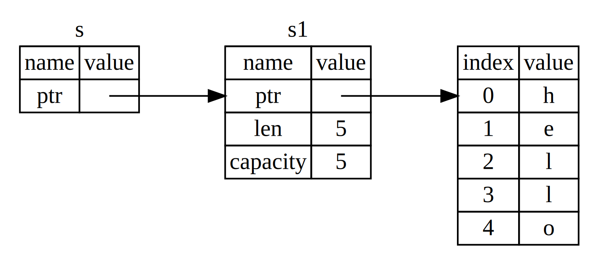
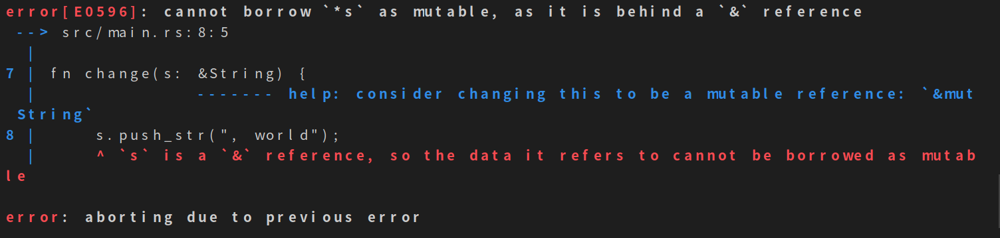

# 引用和借用（References&Borrowing）
[TOC]

在上一节我们学习了Rust的所有权，知道了所有权是Rust 语法的一个重要特性，也是Rust能够做到不使用GC就能够做到内存回收的法宝。但是，虽然这个很安全，但是在某些情况下确很不方便。这个时候我们就会要用到【引用(References)】这个概念。先看一下例子：
```rust
fn main() {
    let sunny_str = String::from("I am a Rustaceans!🍇");
    let len = calculate_length(&sunny_str);
    println!("'{}' 的长度是{}。", sunny_str, len);
}

fn calculate_length(s: &String) -> usize {
    s.len()
}
// 'I am a Rustaceans!🍇' 的长度是22。
```

这个例子就是字符串传给函数(calculate_length),然后函数把字符串的长度返回给调用方。这个时候就使用了引用，符号是——`&`。使用一个以引用不会占有值的所有权。

> 注意：与使用 <font color=red>&</font> 引用相反的操作是 解引用（dereferencing），它使用解引用运算符—— <font color=red>*</font> 

下图解释这个现象：


让我们看看这个函数调用：
```rust
let sunny_str = String::from("I am a Rustaceans!🍇");
let len = calculate_length(&sunny_str);
```
`&sunny_str` 语法让我们创建一个 指向 值 `sunny_str` 的引用，但是并没有得到它的所有权。因为并不拥有这个值，当引用离开作用域时其指向的值也不会被丢弃。

同理，函数签名使用 `&` 来表明参数`sunny_str`的类型是一个引用。让我们增加一些解释性的注释：

```rust
fn calculate_length(s: &String) -> usize { // s 是对 String 的引用
    s.len()
} // 这里，s 离开了作用域。但因为它并不拥有引用值的所有权， 所以什么也不会发生
```

变量 s 有效的作用域与函数参数的作用域一样，不过当引用离开作用域后并不丢弃它指向的数据，因为我们没有所有权。当函数使用引用而不是实际值作为参数，无需返回值来交还所有权，因为就不曾拥有所有权。

我们将获取引用作为函数参数称为` 借用`（borrowing）。正如现实生活中，如果一个人拥有某样东西，你可以从他那里借来。当你使用完毕，必须还回去。

如果我们尝试修改借用的变量呢？`警告：这行不通！`

```rust
fn main() {
    let s = String::from("hello");

    change(&s);
}

fn change(s: &String) {
    s.push_str(", world");
}
```
编译结果：


> 就像变量默认是不可改变的一样，引用也是如此。（默认）不允许修改引用的值。