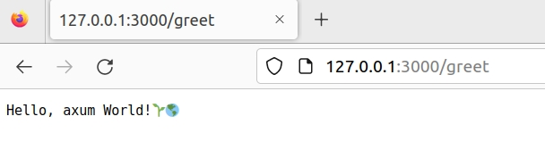
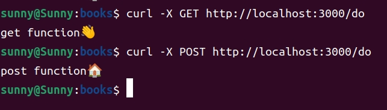

# Axum初步
[TOC]

终于要进入高潮了。
我个人认为：实战是检验程序员的唯一标准！
而通过国Web开发来检验程序员的实战是全面的，这个会考验程序员的综合能力。
使用Rust作为web开发框架的项目还不是很多。我知道的主要有三个：
- [actix-web](https://github.com/actix/actix-web) : 这个之前是大神[Nikolay Kim](https://github.com/fafhrd91)主力开发的，后来由于是否能够使用unsafe这点破事，离开了这个项目，又开发了[ntex](https://github.com/ntex-rs/ntex)这个项目。由于在变换成支持tokio V1.0这个版本的时候非常缓慢，我后来就不在使用这个项目。
  不过，本身这个项目是功能强大、功能完善的。
- [poem](https://github.com/poem-web/poem)：这个项目是由中国的Rust开发大神[sunli,网名：老油条](https://github.com/sunli829)主力维护的项目，这个项目也是非常优秀的项目。使用这个开发一个api网站，非常轻松。而且油条哥回答网友问题非常及时。
  不过，由于本人，没有怎么使用过，在这里就不具体介绍了。有兴趣的人，可以自己尝试
- [axum](https://github.com/tokio-rs/axum):这个项目依托tokio这个组织，由于tokio是实际上的rust的多线程支持的核心，所以很适合我。
  本书就围绕着axum进行介绍和开发。
  当前版本是V0.6,axum由于正在密集开发期间，还没有到1.0,所以版本之间的差距非常大，如果程序有bug，很有可能是因为版本没有选择正确。

## Hello World!
闲言少叙，书归正传。先来一个Hello World。
```shell
$ cargo new helloworld-axum --bin && cd helloworld-axum
$ cargo add axum
$ cargo add tokio -F "full"
$ cat Cargo.toml
```
```toml
[dependencies]
axum = "0.6.4"
tokio = { version = "1.25.0", features = ["full"] }


#修改一下
[dependencies]
axum = "0.6"
tokio = { version = "1.25", features = ["full"] }
```

修改src/main.rs

```rust
use axum::{
    routing::get,
    Router,
};
 
#[tokio::main]
async fn main() {
    // 建立一个简单的路由
    let app = Router::new().route("/greet", get(|| async { "Hello, axum World!🌱🌎" }));
 
    // 起一个http服务在3000端口
    axum::Server::bind(&"0.0.0.0:3000".parse().unwrap())
        .serve(app.into_make_service())
        .await
        .unwrap();
}
```

启动浏览器看一下效果



再加几个路由和函数：

```rust
use axum::{
    routing::get,
    Router,
};
 
#[tokio::main]
async fn main() {
    // 建立一个简单的路由
    let app = Router::new()
            .route("/greet", get(|| async { "Hello, axum World!🌱🌎" }))
            .route("/", get(root))
            .route("/do", get(get_fun).post(post_fun))
            ;
 
    // 起一个http服务在3000端口
    axum::Server::bind(&"0.0.0.0:3000".parse().unwrap())
        .serve(app.into_make_service())
        .await
        .unwrap();
}
async fn root() -> String {
    String::from("Hello root😀.")
}
async fn get_fun() -> String {
    String::from("get function👋")
}
async fn post_fun() -> String {
    String::from("post function🏠")
}
```



看起来很简单吧，那我们接下来就开始新的挑战吧！
