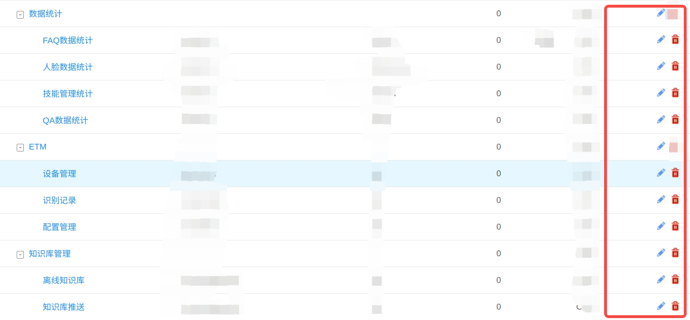
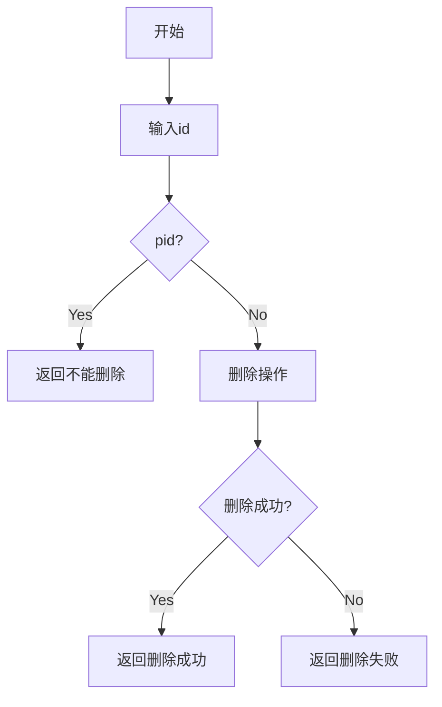
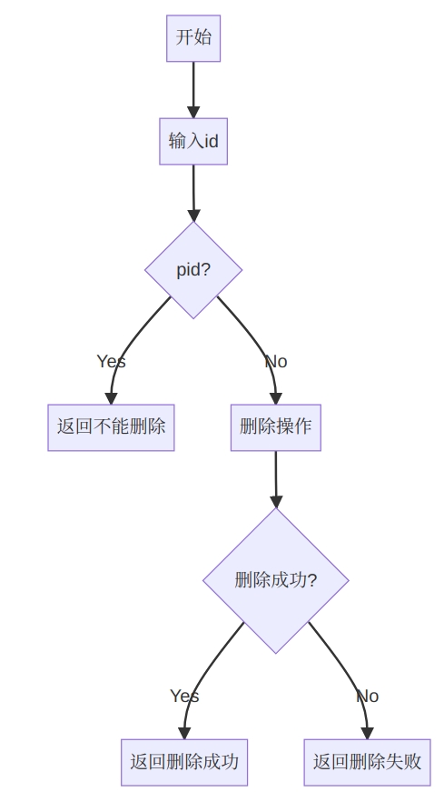
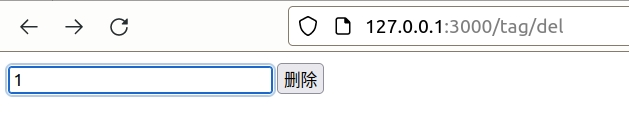
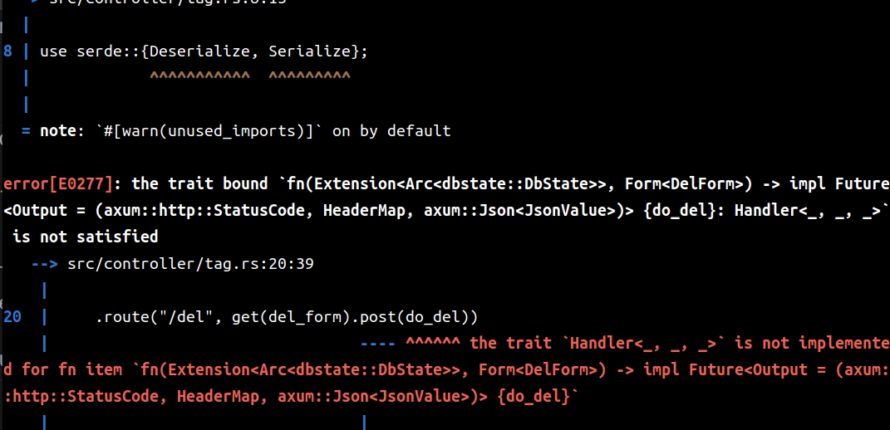
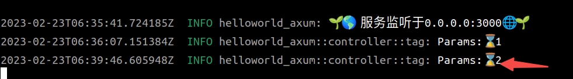
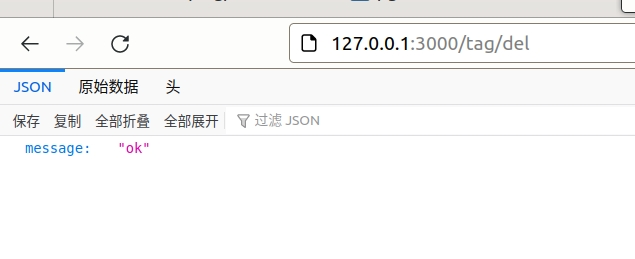

# 使用模板编辑页面

[TOC]

上几节，我们讲解了数据库的操作，包括：连接、查询、缓存。后面我继续讲解数据库的增、删、改。
在讲解这些之前，我需要讲解一下，`Axum`的模板操作，为什么要讲解模板操作哪？因为数据库的增、删、改都会涉及页面的前端操作，当然，按照现在流行的趋势，应该是采用前后分离的方式操作。`Axum`只要做好`API`接口就好，前端由`vue`、 `angular`、`react`来实现。
不过基于两个原因我要讲解一下模板：
- 模板是`Axum`的一个重要的技术点
- 本人不会这三大框架😄

## 模板设置

```shell
$ mkdir templates
```

与`src`平行的位置建立一个目录——`templates`，用于存储模板文件。为了使整个工程看起来专业、整齐，我们做一个约定，那就是在`controller`目录里面的文件叫什么名字，在`templates`里面就建一个相同的目录作为整个文件的模板目录。比如`controller/tag.rs`就建立一个`templates/tag`的目录。

```shell
$ mkdir -p templates/tag
$ cargo add askama
```
`askama`这个`crate` 是操作模板的。

```toml
[dependencies]
askama = "0.11"
```


修改`controller/mod.rs`：

```rust
use crate::{config::WebInfo,AppError,Result};
pub mod index;
pub mod tag;
use axum::{
   response::Html,
};
use askama::Template;
#[allow(dead_code)]
fn get_web_info<'a>(state: &'a WebInfo) -> WebInfo{
   state.to_owned()
}
/// 渲染模板
fn render<T: Template>(tpl: T, handler_name: &str) -> Result<super::util::types::HtmlResponse> {
   let out = tpl
       .render()
       .map_err(AppError::from)
       .map_err(log_error(handler_name))?;
   Ok(Html(out))
}
/// 记录错误
fn log_error(handler_name: &str) -> Box<dyn Fn(AppError) -> AppError> {
   let handler_name = handler_name.to_string();
   Box::new(move |err| {
       tracing::error!("{}: {:?}", handler_name, err);
       err
   })
}
```


## 备份数据库

对于`tag`这个表来说，增、删、改里面最简单的操作使删除，因为相对页面操作会简单一些，其它的操作都需要把`tag`的`BTee`结构显示出来，而这个`BTee`结构显示是比较复杂的，我会在后面详细讲解。

不过，数据库的删除是一个危险的动作，会破坏掉所有数据，为了数据不丢失，我们首先把数据库里面的内容备份一下：

```shell
$ pg_dump -h 127.0.0.1 -U sa helloworld > helloworld.pgdb
$ cat helloworld.pgdb
--
-- PostgreSQL database dump
--

-- Dumped from database version 13.10 (Debian 13.10-1.pgdg110+1)
-- Dumped by pg_dump version 14.6 (Ubuntu 14.6-0ubuntu0.22.04.1)

SET statement_timeout = 0;
SET lock_timeout = 0;
SET idle_in_transaction_session_timeout = 0;
SET client_encoding = 'UTF8';
SET standard_conforming_strings = on;
SELECT pg_catalog.set_config('search_path', '', false);
SET check_function_bodies = false;
SET xmloption = content;
SET client_min_messages = warning;
SET row_security = off;

--
-- Name: sunny_rbac; Type: SCHEMA; Schema: -; Owner: sa
--

CREATE SCHEMA sunny_rbac;


ALTER SCHEMA sunny_rbac OWNER TO sa;

SET default_tablespace = '';

SET default_table_access_method = heap;

--
-- Name: tag; Type: TABLE; Schema: sunny_rbac; Owner: sa
--

CREATE TABLE sunny_rbac.tag (
    id integer NOT NULL,
    name character varying(50) NOT NULL,
    pid integer NOT NULL
);


ALTER TABLE sunny_rbac.tag OWNER TO sa;

--
-- Name: tag_id_seq; Type: SEQUENCE; Schema: sunny_rbac; Owner: sa
--

CREATE SEQUENCE sunny_rbac.tag_id_seq
    AS integer
    START WITH 1
    INCREMENT BY 1
    NO MINVALUE
    NO MAXVALUE
    CACHE 1;


ALTER TABLE sunny_rbac.tag_id_seq OWNER TO sa;

--
-- Name: tag_id_seq; Type: SEQUENCE OWNED BY; Schema: sunny_rbac; Owner: sa
--

ALTER SEQUENCE sunny_rbac.tag_id_seq OWNED BY sunny_rbac.tag.id;


--
-- Name: tag id; Type: DEFAULT; Schema: sunny_rbac; Owner: sa
--

ALTER TABLE ONLY sunny_rbac.tag ALTER COLUMN id SET DEFAULT nextval('sunny_rbac.tag_id_seq'::regclass);


--
-- Data for Name: tag; Type: TABLE DATA; Schema: sunny_rbac; Owner: sa
--

COPY sunny_rbac.tag (id, name, pid) FROM stdin;
0       root    0
1       文字    0
2       QA      1
3       FAQ     1
4       音频    0
5       歌曲    4
6       戏曲    4
7       音乐    4
8       民乐    7
9       轻音乐  7
10      交响乐  7
11      电子音乐        7
12      动作    0
13      手👋    12
14      脚🩹     12
\.


--
-- Name: tag_id_seq; Type: SEQUENCE SET; Schema: sunny_rbac; Owner: sa
--

SELECT pg_catalog.setval('sunny_rbac.tag_id_seq', 14, true);


--
-- Name: tag tag_pkey; Type: CONSTRAINT; Schema: sunny_rbac; Owner: sa
--

ALTER TABLE ONLY sunny_rbac.tag
    ADD CONSTRAINT tag_pkey PRIMARY KEY (id);


--
-- PostgreSQL database dump complete
--
```

等需要恢复的时候，执行下面的语句：

```shell
$ psql -h localhost -U sa -d helloworld < helloworld.pgdb
```

## 简单的显示

在做复杂的显示前面，我们先做一个简单的显示，就是在页面中显示一个**数据来自tag**。

### 写一个简单的模板

最终的样式应该是类似这样的图



这个要在后面来实现，我们先做一个简单的，一个输入框（输入`tag`的`id`），一个确认键。

如果输入的`id`是别的`tag`的`pid`,返回不能删除，如果不是返回删除结果。






现在正式写一下这个模板，`templates/tag/delete.html`

```html
<!DOCTYPE html>
<html>
  <head>
    <meta charset="UTF-8" />
    <title>Delete</title>
  </head>
  <body>
    <div>
        <form name="del_form" method="post">
            <input type="text" name="id" id="del_id" value="" />
            <input type="submit" value="删除" />
        </form>
    </div>
  </body>
</html>
```


### 修改一下`controller/tag.rs`

```rust
use axum::{
    Extension,Router,routing::{get} ,
    extract::Path,
    http::{header::HeaderName, HeaderMap, HeaderValue, StatusCode},
    Json,
};
use askama::Template;
use super::{render};
use crate::{model::*,util::*,dbstate::*};
use std::sync::Arc;
use tower_http::{trace::TraceLayer};
pub(crate) fn index_router() -> Router {
    Router::new()
    .route("/list", get(list))
    .route("/tree", get(get_tree))
    .route("/find/:id", get(get_one))
    .route("/del", get(del_form))
    .layer(TraceLayer::new_for_http())
}
#[derive(Template)]
#[template(path = "tag/delete.html")]
pub struct TagDeleteTemplate {}
/// 显示del页面
async fn del_form()-> crate::Result<crate::util::types::HtmlResponse> {
    let handler_name = "DeleteTagById";
    let tpl = TagDeleteTemplate{};
    render(tpl, handler_name)
}
```

请求一下：



是我要的界面，我们继续。

## 接受`post`参数

`Axum`有`Form`这方法来传输数据，跟着我一步一步操作，go！

修改`controller/tag.rs`

```rust
use axum::{
    Extension,Router,routing::{get} ,
    extract::{Path,},
    http::{header::HeaderName, HeaderMap, HeaderValue, StatusCode},
    Json,
    Form,
};
use serde::{Deserialize, Serialize};  // 这个很重要!!!
// 下面没有Deserialize会报错，而且是让你完全不知道怎么改的报错，见下图
#[derive(Debug, Clone, PartialEq,Deserialize,  sqlx::FromRow)] 
pub struct DelForm{
    pub id: i32,
}
```



继续修改`controller/tag.rs`

```rust
pub(crate) fn index_router() -> Router {
    Router::new()
    .route("/list", get(list))
    .route("/tree", get(get_tree))
    .route("/find/:id", get(get_one))
    .route("/del", get(del_form).post(do_del))
    .layer(TraceLayer::new_for_http())
}
pub async fn do_del(
    Extension(state): Extension<Arc<DbState>>,
    Form(del_form): Form<DelForm>,
)-> HandlerJsonResult{
    let mut headers = HeaderMap::new();
    headers.insert(
        HeaderName::from_static("content-type"),
        HeaderValue::from_static("application/json;charset=utf-8"),
    );
    tracing::info!("Params:⌛{:?}",&del_form.id);
    let result = Json(serde_json::json!({"result":"delete"}));
    let code = StatusCode::OK;
    (code, headers, result)
}
```

请求一下：

```shell
$ curl -i -X POST -d "id"=2 127.0.0.1:3000/tag/del
HTTP/1.1 200 OK
content-type: application/json;charset=utf-8
content-length: 19
date: Thu, 23 Feb 2023 06:39:46 GMT

{"result":"delete"}
```



数据完整，说明我们的`Form`和`POST`方法都成功了下面，我开始真正的`model`操作。

```rust
#[allow(dead_code)]
pub async fn delete<'a>(state: &'a DbState,id:i32) -> Result<String> {
    let pool = get_conn(&state);
    let mut sql=format!("SELECT count(1) as count from {} where pid ={}",get_table_name(),id);    
    let rows = sqlx::query_as::<_, CountModel>(&sql)
        .fetch_one(pool)
        .await
        .unwrap();
    if rows.count!=0{
        let code = AppError::from_err(format!("id:{}是个父类，不能删除",id).into(),crate::AppErrorType::Database);
        return Err(code);
    }   
    Ok("ok".to_string())
}
```

这个是实现id是一个pid，不能被删除。

完整的代码：

```rust
#[allow(dead_code)]
pub async fn delete<'a>(state: &'a DbState,id:i32) -> Result<String> {
    let pool = get_conn(&state);
    let mut sql=format!("SELECT count(1) as count from {} where pid ={}",get_table_name(),id);    
    let rows = sqlx::query_as::<_, CountModel>(&sql)
        .fetch_one(pool)
        .await
        .unwrap();
    if rows.count!=0{
        let code = AppError::from_err(format!("id:{}是个父类，不能删除",id).into(),crate::AppErrorType::Database);
        return Err(code);
    }
    sql=format!("Delete from {} where id ={}",get_table_name(),id);
    let res=sqlx::query(&sql)
    .execute(pool)
    .await;
    match res {
        Ok(result) => {
            let _rows=result.rows_affected();
            if _rows==0{
                let code = AppError::from_err(format!("库里不存在id:{}，无法删除",id).into(),crate::AppErrorType::Database);
                return Err(code);
            }
        },
        Err(err) => {
            println!("Err----{:?}",err);
            let code = AppError::from_err(err.into(),crate::AppErrorType::Database);
            return Err(code);
        }
    }

    Ok("ok".to_string())
}
```


请求一下：

```shell
$ curl -i -X POST -d "id"=50 127.0.0.1:3000/tag/del
HTTP/1.1 200 OK
content-type: application/json;charset=utf-8
content-length: 49
date: Fri, 24 Feb 2023 08:49:35 GMT

{"message":"库里不存在id:50，无法删除"}

$ curl -i -X POST -d "id"=14 127.0.0.1:3000/tag/del
HTTP/1.1 200 OK
content-type: application/json;charset=utf-8
content-length: 49
date: Fri, 24 Feb 2023 08:49:35 GMT

{"message":"ok"}
```

浏览器访问一下




完美收官！