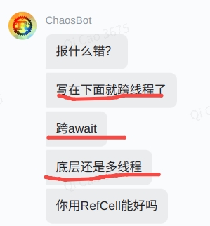

# 一个奇怪的问题

[TOC]

## 说说情况

原本是想对之前的`TagModel`增加一个`is_parent`的字段，为了直接判断是不是`pid`方便。

```rust
#[derive(Debug, Clone, PartialEq, Serialize, Deserialize, sqlx::FromRow)]
pub struct TagModel {
    pub id: i32,
    pub name: String,
    pub pid: i32,
    pub level:i64,
    pub is_parent:bool,
}
```

原来的想法比较简单，就是在插入每行数据到`TagNode`的时候，直接搜索数据库，判断一下这个`id`是不是一个`pid`。

```rust
for row in rows {
    // 此处插入判断 
    let node=TagNode{id: row.id, name: row.name, parent_id: row.pid, childs: Vec::new(),level:0};
    nodes.insert(node.id, RefCell::new(node.clone()));
}
```

为此，我还把这个判断写成了一个专门的函数：

```rust
/// 判断id是不是一个pid
async fn is_parent<'a>(state: &'a DbState,id:i32) ->Result<bool>{
   let pool = get_conn(&state);
   let sql=format!("SELECT count(1) as count from {} where pid ={}",get_table_name(),id);
   let mut b=false;  
   let parent_rows = sqlx::query_as::<_, CountModel>(&sql)
       .fetch_one(pool)
       .await;
    match parent_rows {
            Ok(result) => {
                if result.count!=0{
                    b=true;
                }
            },
            Err(err) => {
                tracing::error!("----{}---",err);
            }
    }
    Ok(b)
}
```

意外在此时发生：

```rust
for row in rows {
    // 此处插入判断 
    let b=is_parent(state,id).await.unwrap();
    let node=TagNode{id: row.id, name: row.name, parent_id: row.pid, childs: Vec::new(),level:0};
    nodes.insert(node.id, RefCell::new(node.clone()));
}
```

报错的显示是：


明显和这个报错没有任何关系，我做了各种猜测个和假设，都是不正确的，最后我发现了这么一个情况


问题出在了这里,

```rust
let mut nodes: BTreeMap<i32, RefCell<TagNode>> = BTreeMap::new();
```

把函数调用写在这句上面就ok，写在下面就over。这个时候张汉东大佬的一句话说出了事实的真相：



虽然，我现在还没有完全理解这句话的真正含义，但是我修改了代码，实现了目标。

修改后的`model/tag.rs`

```rust
use redis::{Commands, };
use serde::{Deserialize, Serialize};
use super::{get_conn, get_redis_conn};
use crate::AppError;
use crate::{dbstate::DbState,Result};
use std::collections::BTreeMap;
use std::cell::{RefCell,};

#[derive(Debug, Clone, PartialEq, Serialize, Deserialize, sqlx::FromRow)]
pub struct CountModel {
    pub count:i64,
}
#[derive(Debug, Clone, PartialEq, Serialize, Deserialize, sqlx::FromRow)]
pub struct PidModel {
    pub id:i32,
}
#[derive(Debug, Clone, PartialEq, Serialize, Deserialize, sqlx::FromRow)]
pub struct Model {
    pub id: i32,
    pub name: String,
    pub pid: i32,
}
#[derive(Debug, Clone, PartialEq, Serialize, Deserialize, sqlx::FromRow)]
pub struct TagModel {
    pub id: i32,
    pub name: String,
    pub pid: i32,
    pub level:i64,
    pub is_parent:bool,
}
#[derive(Debug, Clone)]
pub struct TagNode<'a> {
    pub id: i32,
    pub name: String,
    /// The node may or may not have a parent
    pub parent_id: i32,
    /// Use a RefCell to a Node to allow the usage of `borrow_mut`
    pub childs: Vec<&'a RefCell<TagNode<'a>>>,
    pub level:i64,
    pub is_parent:bool,
}

impl<'a> TagNode<'a> {
    /// Recursive function that prints the node and the childs.
    pub fn print_node(&self, depth: i64) {
        // Probably a bad way to indent based on the depth of the node
        let mut indent = String::from(" ");
        for _ in 0..depth {
            indent.push_str(" ");
        }

        println!("{}- id: {}, name: {},pid:{},level:{}", indent, self.id, self.name,self.parent_id,self.level);

        for child in self.childs.iter() {
            child.borrow().print_node(depth + 1);
        }
    }

    /// 把node转化为TagModel
    pub fn set_node_to_model(&self, depth: i64,tag_model:&mut  Vec<TagModel>) {
        let tm=TagModel{id:self.id,name:self.name.clone(),pid:self.parent_id,level:self.level,is_parent:self.is_parent};
        tag_model.push(tm);
        for child in self.childs.iter() {
            child.borrow_mut().set_node_to_model(depth + 1,tag_model);
        }
    }
    /// Push a reference to a child in the childs vector
    pub fn add_child(&mut self, child: &'a RefCell<TagNode<'a>>) {
        self.childs.push(child);
    }
}


#[allow(dead_code)]
pub(crate) fn get_table_name()->&'static str{
    "sunny_rbac.tag"
}

#[allow(dead_code)]
pub async fn get_all_tag<'a,'b>(state: &'a DbState,order:Option<&'b str>) -> Result<Vec<Model>> {
    let str_order=order.unwrap_or("");
    #[allow(unused_assignments)]
    let mut sql=String::new();
    if str_order.len()==0{
        sql=format!("SELECT id, name,pid from {}",get_table_name());
    }else{
        sql=format!("SELECT id, name,pid from {} order by {}",get_table_name(),str_order);
    }
    let pool = get_conn(&state);
    
    let rows = sqlx::query_as::<_, Model>(&sql)
        .fetch_all(pool)
        .await
        .unwrap();
    Ok(rows)
}

#[allow(dead_code)]
pub async fn get_one_by_id<'a,'b>(state: &'a DbState,id:i32) -> Result<Model> {
    #[allow(unused_assignments)]
    let mut sql=String::new();
    sql=format!("SELECT id, name,pid from {} where id ={}",get_table_name(),id);
    let pool = get_conn(&state);
    let rows = sqlx::query_as::<_, Model>(&sql)
        .fetch_one(pool)
        .await
        .unwrap();
    Ok(rows)
}

#[allow(dead_code)]
pub async fn get_tag_tree<'a>(state: &'a DbState) -> Result<Vec<TagModel>> {
    // 操作redis
    let client=get_redis_conn(&state);
    let mut redis_conn = client.get_connection().expect("redis connect error");
    let mut b_have_key=false;  //是否有缓存
    let rv:redis::RedisResult<String> = redis_conn.get("tag_tree");//读取缓存
    let result =match rv {
        Ok(issue) => {
            b_have_key=true;
            issue
        },
        Err(_err) => {
            "".to_string()
        }
    };
    let mut  tag_models:Vec<TagModel>= vec![];
    if !b_have_key{
        let pool = get_conn(&state);
        let  mut sql=format!("SELECT id, name,pid from {} where id<>0;",get_table_name());
        let rows = sqlx::query_as::<_, Model>(&sql)
            .fetch_all(pool)
            .await
            .unwrap();
        sql=format!("SELECT distinct(pid) as id FROM {} order by pid ASC;",get_table_name());
        let pid_rows=sqlx::query_as::<_, PidModel>(&sql)
        .fetch_all(pool)
        .await;
        let pids=match pid_rows {
            Ok(result) =>result,
            Err(_) => vec![],
        };
        let mut nodes: BTreeMap<i32, RefCell<TagNode>> = BTreeMap::new();
        for row in rows {
            let mut bpid=false;
            for pid in &pids{
                if row.id==pid.id{
                    bpid=true;
                    break;
                }
            }
            let node=TagNode{id: row.id, name: row.name, parent_id: row.pid, childs: Vec::new(),level:0,is_parent:bpid};
            nodes.insert(node.id, RefCell::new(node.clone()));
        }
        let mut tree: Vec<&RefCell<TagNode>> = Vec::new();
    
        for (node_id, node_ref) in nodes.iter() {
            // If node is a parent, store it directly on the tree
            if nodes[node_id].borrow().parent_id == 0 {
                tree.push(node_ref);
            }
            // If node is a child, insert it into its parent childs' vector
            else {
                let parent = &nodes[&node_ref.borrow().parent_id];
                let level=parent.borrow().level+1;
                node_ref.borrow_mut().level=level;
                parent.borrow_mut().add_child(&node_ref);
            }
        }
        
        for parent in tree.iter() {
            // parent.borrow().print_node(0);
            
            parent.borrow_mut().set_node_to_model(0, &mut tag_models);
        }

        // 插入redis
        let strm:String=serde_json::to_string(&tag_models).unwrap();
        let _:()=redis_conn.set("tag_tree",  strm).unwrap();

        

    }else{
        //把从redis里面取出来的字符串，反序列化为TagModel结构
        tag_models=serde_json::from_str(&result).unwrap();
    }
    

    Ok(tag_models)
}


#[allow(dead_code)]
pub async fn delete<'a>(state: &'a DbState,id:i32) -> Result<String> {
    let pool = get_conn(&state);
    let b=is_parent(state,id).await.unwrap();
    if b{
        let code = AppError::from_err(format!("id:{}是个父类，不能删除",id).into(),crate::AppErrorType::Database);
        return Err(code);
    }
    let sql=format!("Delete from {} where id ={}",get_table_name(),id);
    let res=sqlx::query(&sql)
    .execute(pool)
    .await;
    match res {
        Ok(result) => {
            let _rows=result.rows_affected();
            if _rows==0{
                let code = AppError::from_err(format!("库里不存在id:{}，无法删除",id).into(),crate::AppErrorType::Database);
                return Err(code);
            }
        },
        Err(err) => {
            println!("Err----{:?}",err);
            let code = AppError::from_err(err.into(),crate::AppErrorType::Database);
            return Err(code);
        }
    }

    Ok("ok".to_string())
}

/// 判断id是不是一个pid
async fn is_parent<'a>(state: &'a DbState,id:i32) ->Result<bool>{
   let pool = get_conn(&state);
   let sql=format!("SELECT count(1) as count from {} where pid ={}",get_table_name(),id);
   let mut b=false;  
   let parent_rows = sqlx::query_as::<_, CountModel>(&sql)
       .fetch_one(pool)
       .await;
    match parent_rows {
            Ok(result) => {
                if result.count!=0{
                    b=true;
                }
            },
            Err(err) => {
                tracing::error!("----{}---",err);
            }
    }
    Ok(b)
}
```

