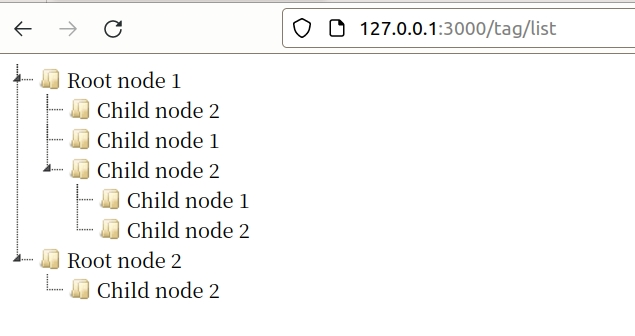

# `Tag`显示

[TOC]

> 本来上一节就应该写显示，没想到遇到了上一节的问题。闲言少叙，进入正题。


## 例子展示

网上找了一个`jQueryTree`的例子，我们先展示出来：

```html
<!DOCTYPE html>
<html>
<head>
  <meta charset="utf-8">
  <title>jsTree test</title>
  <!-- 2 load the theme CSS file -->
  <link rel="stylesheet" href="https://cdnjs.cloudflare.com/ajax/libs/jstree/3.2.1/themes/default/style.min.css" />
  <!-- 4 include the jQuery library -->
  <script src="https://cdnjs.cloudflare.com/ajax/libs/jquery/1.12.1/jquery.min.js"></script>
  <!-- 5 include the minified jstree source -->
  <script src="https://cdnjs.cloudflare.com/ajax/libs/jstree/3.2.1/jstree.min.js"></script>
</head>
<body>
  <!-- 3 setup a container element -->
  <div id="jstree">
    <!-- in this example the tree is populated from inline HTML -->
    <ul>
      <li>Root node 1
        <ul>
          <li id="child_node_1">Child node 1</li>
          <li>Child node 2</li>
        </ul>
        <ul>
          <li id="child_node_2">Child node 1</li>
          <li>Child node 2
            <ul>
              <li id="child_node_1">Child node 1</li>
              <li>Child node 2</li>
            </ul>
          </li>
        </ul>
      </li>
      <li>Root node 2
        <ul>
          <li id="child_node_1">Child node 1</li>
          <li>Child node 2</li>
        </ul>
      </li>
    </ul>
  </div>
  <!-- <button>demo button</button> -->

  
  <script>
  $(function () {
    // 6 create an instance when the DOM is ready
    $('#jstree').jstree();
    // 7 bind to events triggered on the tree
    $('#jstree').on("changed.jstree", function (e, data) {
      console.log(data.selected);
    });
    // 8 interact with the tree - either way is OK
    // $('button').on('click', function () {
    //   $('#jstree').jstree(true).select_node('child_node_1');
    //   $('#jstree').jstree('select_node', 'child_node_1');
    //   $.jstree.reference('#jstree').select_node('child_node_1');
    // });
  });
  </script>
</body>
</html>
```

修改`controller/tag.rs`：

```rust
#[derive(Template)]
#[template(path = "tag/list.html")]
pub struct ListForm{}

pub async fn list() -> Result<HtmlResponse> {
    let handler_name = "list";
    let tpl = ListForm{};
    render(tpl, handler_name)
}
```

访问一下



现在就需要作的就是目录树最好是从后端生成的，修改如下：

`template/tag/list.html`

```html
<!DOCTYPE html>
<html>

<head>
  <meta charset="utf-8">
  <title>jsTree test</title>
  <!-- 2 load the theme CSS file -->
  <link rel="stylesheet" href="https://cdnjs.cloudflare.com/ajax/libs/jstree/3.2.1/themes/default/style.min.css" />
  <!-- 4 include the jQuery library -->
  <script src="https://cdnjs.cloudflare.com/ajax/libs/jquery/1.12.1/jquery.min.js"></script>
  <!-- 5 include the minified jstree source -->
  <script src="https://cdnjs.cloudflare.com/ajax/libs/jstree/3.2.1/jstree.min.js"></script>
</head>

<body>
  <!-- 3 setup a container element -->
  <div id="jstree">
    <!-- in this example the tree is populated from inline HTML -->
    <ul>
      <li>
        Root
        {{ul}}
      </li>
    </ul>
  </div>
  <!-- <button>demo button</button> -->


  <script>
    $(function () {
      // 6 create an instance when the DOM is ready
      $('#jstree').jstree();
      // 7 bind to events triggered on the tree
      $('#jstree').on("changed.jstree", function (e, data) {
        console.log(data.selected);
      });
      $.jstree.reference('#jstree').select_node('child_node_1')
      // 8 interact with the tree - either way is OK
      // $('button').on('click', function () {
      //   $('#jstree').jstree(true).select_node('child_node_1');
      //   $('#jstree').jstree('select_node', 'child_node_1');
      //   $.jstree.reference('#jstree').select_node('child_node_1');
      // });
    });
  </script>
</body>
</html>
```


`controller/tags`

```rust
#[derive(Template)]
#[template(path = "tag/list.html",ext = "html", escape = "none")]
pub struct ListForm<'a>{ pub ul:&'a str,}

pub async fn list() -> Result<HtmlResponse> {
    let handler_name = "list";
    let ul=r#"<ul>
    <li>Root node 1
      <ul>
        <li id="child_node_1">Child node 1</li>
        <li>Child node 2</li>
      </ul>
      <ul>
        <li id="child_node_2">Child node 1</li>
        <li>Child node 2
          <ul>
            <li id="child_node_1">Child node 1</li>
            <li>Child node 2</li>
          </ul>
        </li>
      </ul>
    </li>
    <li>Root node 2
      <ul>
        <li id="child_node_1">Child node 1</li>
        <li>Child node 2</li>
      </ul>
    </li>
  </ul>"#;
    let tpl = ListForm{ul:ul};
    render(tpl, handler_name)
}
```

這樣就可以在服務端生成列表，在前端展示。

接下来我们就需要把数组转化为`html`。