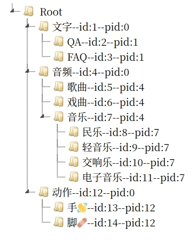
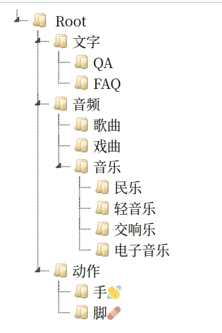
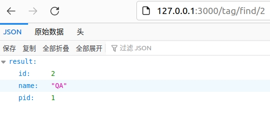

# `Tag`显示二

[TOC]

> 为了能够很好的拼接出HTML串，我在本节使用到了栈的技术，也就是【*LIFO*结构】

## 创建stack结构

这个`stack`我以后还要用到所以使用了泛型结构，还把它放在了`util`目录下。

`util/stack.rs`

```rust
#[derive(Debug)]
pub struct Stack<T> {
    pub items: Vec<T>,
}

impl<T> Stack<T> {
    pub fn new() -> Stack<T> {
        Stack { items: Vec::new() }
    }

    pub fn push(&mut self, item: T) {
        self.items.push(item);
    }

    pub fn pop(&mut self) -> Option<T> {
        self.items.pop()
    }
    /// 取得最上面的一条数据
    pub fn get_pop(&self) -> Option<&T> {
        self.items.last()
    }
    pub fn is_empty(&self) -> bool {
        self.items.is_empty()
    }

    pub fn size(&self) -> usize {
        self.items.len()
    }
}
```

修改`util/mod.rs`

```rust
pub mod types;
pub mod stack;
```

修改`controller/tag.rs`

```rust
/// 判断是不是要压栈
fn judge_push(stack:&Stack<TagModel>,tml:&TagModel)->bool{
    #[allow(unused_assignments)]
    let mut result=false;
    if tml.level==-1 {return true;}
    let old=stack.get_pop();
    let o=match old{
        Some(val)=>val.to_owned(),
        None=> TagModel{ id: 0, name: "Root".to_string(), pid: 0, level: -9, is_parent: true },
    };
    if o.level==-9 {
        result=true;
    }else{
        if tml.pid==o.id{
            result=true;
        }else{
            result=false
        }
    }
    result
}
/// 拼接Tree的html字符串
fn set_html(stack:&mut Stack<TagModel>,tml:&TagModel,html:String)->String{
    let mut str_html=html;
    if judge_push(&stack,&tml){
        let s=format!("<ul><li id='{}' level='{}'>{}--id:{}--pid:{}",tml.name,tml.level,tml.name,tml.id,tml.pid);
        str_html+= &s;
        stack.push(tml.to_owned());
    }else{
        if !stack.is_empty(){
            loop {
                    let l_stack = stack.pop().unwrap();
                    str_html += r#"</li>"#;
                    if l_stack.pid == tml.pid {
                        break;
                    }
                    str_html += r#"</ul>"#;
                }
            let s=format!("<li id='{}' level='{}'>{}--id:{}--pid:{}",tml.name,tml.level,tml.name,tml.id,tml.pid);
            str_html+= &s;
            stack.push(tml.to_owned());
        }
    }
    str_html
}

pub async fn list(Extension(state): Extension<Arc<DbState>>,) -> Result<HtmlResponse> {
    let tags=tag::get_tag_tree(&state).await.unwrap();
    let handler_name = "list";
    let mut str_html=String::from("");
    let mut stack = Stack::new();
    for tag in tags{
        str_html=set_html(&mut stack,&tag,str_html);
    }

    let tpl = ListForm{ul:&str_html};
    render(tpl, handler_name)
}
```


效果如下：



接下来我们要做的就是点击

修改一下`controller/tag.rs`

```rust

/// 拼接Tree的html字符串
fn set_html(stack:&mut Stack<TagModel>,tml:&TagModel,html:String)->String{
    let mut str_html=html;
    if judge_push(&stack,&tml){
        // 此处加上连接
        let s=format!("<ul><li id='tree_{}'><a href='./find/{}'>{}</a>",tml.id,tml.id,tml.name);
        str_html+= &s;
        stack.push(tml.to_owned());
    }else{
        if !stack.is_empty(){
            if tml.level==0{
                loop{
                    let l_stack=stack.pop().unwrap();
                    str_html+= r#"</li></ul>"#;
                    if l_stack.level==0{
                        str_html+= r#"<ul>"#;
                        break;
                    }                    
                } 
            }else{
                let _l_stack=stack.pop().unwrap();  
                str_html+= r#"</li>"#;
            }
            let s=format!("<li id='tree_{}'><a href='./find/{}'>{}</a>",tml.id,tml.id,tml.name);
            str_html+= &s;
            stack.push(tml.to_owned());
        }
    }
    str_html
}
```

修改`template/tag/list.html`

```html
<!DOCTYPE html>
<html>

<head>
  <meta charset="utf-8">
  <title>jsTree test</title>
  <link rel="icon" type="image/svg+xml" href="/images/favicon.svg">
  <!-- 2 load the theme CSS file -->
  <link rel="stylesheet" href="https://cdnjs.cloudflare.com/ajax/libs/jstree/3.2.1/themes/default/style.min.css" />
  <!-- 4 include the jQuery library -->
  <script src="https://cdnjs.cloudflare.com/ajax/libs/jquery/1.12.1/jquery.min.js"></script>
  <!-- 5 include the minified jstree source -->
  <script src="https://cdnjs.cloudflare.com/ajax/libs/jstree/3.2.1/jstree.min.js"></script>
</head>

<body>
  <!-- 3 setup a container element -->
  <div id="jstree">
    <!-- in this example the tree is populated from inline HTML -->
    <ul>
      <li id="Root">
        Root
        {{ul}}
      </li>
    </ul>
  </div>
  <script>
    $(function () {
      // 6 create an instance when the DOM is ready
      $('#jstree').jstree();

      $('#jstree').on('activate_node.jstree', function (e, data) {
        var href = data.node.a_attr.href;
        if (href) {
          window.location.href = href;
        }
      });

      // 页面加载完，整个树展开
      $('#jstree').bind("ready.jstree", function () {
        $('#jstree').jstree("open_all");
      });
    });
  </script>
</body>

</html>
```

浏览器运行一下：



鼠标点击一下QA:



这个是简单的示例，具体的操作在下节再讲。