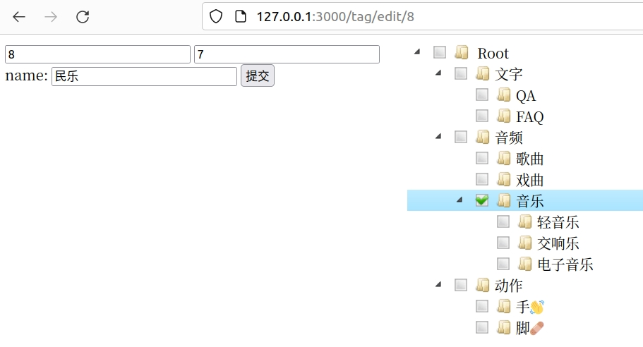

# 编辑`Tag`页面一

> 上节讲了，展示`Tag Tree`，最后超链接现实的是find/2类似的页面，不过，这个页面是没法编辑的，我们现在开始搞编辑页面。

## 创建`edit`

首先在`template/tag`下面创建一个`edit.html`

```html
<!DOCTYPE html>
<html>

<head>
  <meta charset="utf-8">
  <title>jsTree edit</title>

  <link rel="alternate icon" type="image/png" href="https://www.rust-lang.org/static/images/favicon-16x16.png">
  <link rel="alternate icon" type="image/png" href="https://www.rust-lang.org/static/images/favicon-32x32.png">
  <link rel="icon" type="image/svg+xml" href="/images/favicon.svg">
  <!-- 2 load the theme CSS file -->
  <link rel="stylesheet" href="https://cdnjs.cloudflare.com/ajax/libs/jstree/3.2.1/themes/default/style.min.css" />
  <!-- 4 include the jQuery library -->
  <script src="https://cdnjs.cloudflare.com/ajax/libs/jquery/1.12.1/jquery.min.js"></script>
  <!-- 5 include the minified jstree source -->
  <script src="https://cdnjs.cloudflare.com/ajax/libs/jstree/3.2.1/jstree.min.js"></script>
</head>

<body>
  <div style="display: flex;">
    <div style="flex: 0 0 30%; ">
      <!-- 左边内容 -->
      <form id="edit_form" name="form" method="post" action="/tag/doedit">
        <input type="hidden" id="id" name="id" value="{{id}}" readonly="readonly" />
        <input type="hidden" id="pid" name="pid" value="{{pid}}" readonly="readonly" />
        <div id="jstree" style="flex: 1;">
          <!-- in this example the tree is populated from inline HTML -->
          <ul>
            <li id="tree_0">
              Root
              {{ul}}
            </li>
          </ul>
        </div>
        <label for="name">name:</label> <input type="text" id="name" name="name" value="{{name}}" />
        <input type="submit" value="提交" />
      </form>
    </div>
    <!-- 3 setup a container element -->
    
  </div>

  <script>
    $(function () {
      // 6 create an instance when the DOM is ready
      //$('#jstree').jstree();
      $('#jstree').jstree({
        'plugins': ["wholerow", "checkbox", "types"],
        'checkbox': {
          "three_state": false//父子级不关联选中
        },
        'core': {
          "multiple": false,//单选
          "themes": {
            "responsive": false
          },
        }
      });
      $('#jstree').on('select_node.jstree', function (e, data) {
        var id = data.node.id;
      });
      // 页面加载完，整个树展开
      $('#jstree').bind("ready.jstree", function () {
        $('#jstree').jstree("open_all");
      });

      $('#jstree').on("changed.jstree", function (e, data) {
        // console.log(data.selected);
        var oStr = data.selected + "";
        $("#pid").val(oStr.substr(5));
      });
      $('#jstree').jstree('select_node', 'tree_{{pid}}');

      $('#edit_form').on("submit", function (e) {
       
        if (($('#pid').val()=={{pid}}) && ($('#name').val()=="{{name}}")){
          alert('The data is not modify!');
        }else{
          $('#edit_form').submit();
        }
        e.preventDefault(); // cancel the actual submit
      });
    });
  </script>
</body>

</html>
```

首先先做一下简单的编辑页面显示，在这里有一个特点，就是在`tag tree`里面，这个`id`本身或者以这个`id`为`pid`的不显示。修改一下`controller/tag.rs`

```rust
pub async fn edit(
    Extension(state): Extension<Arc<DbState>>,
    Path(id): Path<i32>,
) -> Result<HtmlResponse> {
	let tags=tag::get_tag_tree(&state).await.unwrap();
    let handler_name = "edit";
    let mut str_html=String::from("");
    let mut stack = Stack::new();
    for tag in tags{
        if (tag.id!=id && tag.pid!=id)||id==0{ //在`tag tree`里面，这个`id`本身或者以这个`id`为`pid`的不显示
            str_html=set_html(&mut stack,&tag,str_html,false);
        }
    }
    let m=tag::get_one_by_id(&state,id).await.unwrap_or(Model { id: 0, name: "".to_string(), pid: 0 });
    let tpl = EditForm{ul:&str_html,id:id,pid:m.pid,name:&m.name};
    render(tpl, handler_name)
}


/// 拼接Tree的html字符串
/// have_link用于判断是不是要有超链接
/// 拼接Tree的html字符串
fn set_html(stack: &mut Stack<TagModel>, tml: &TagModel, html: String, have_link: bool) -> String {
    let mut str_html = html;
    #[allow(unused_assignments)]
    let mut s = String::new();
    if judge_push(&stack, &tml) {
        
        if have_link {
            s = format!(
                "<ul><li id='tree_{}' pid='{}'><a href='./edit/{}'>{}</a>",
                tml.id,tml.pid, tml.id, tml.name
            );
        } else {
            s = format!("<ul><li id='tree_{}' pid='{}'>{}", tml.id,tml.pid, tml.name);
        }
        str_html += &s;
        stack.push(tml.to_owned());
    } else {
        if !stack.is_empty() {
                loop {
                    let l_stack = stack.pop().unwrap();
                    str_html += r#"</li>"#;
                    if l_stack.pid == tml.pid {
                        break;
                    }
                    str_html += r#"</ul>"#;
                }
            if have_link {
                s = format!(
                    "<li id='tree_{}' pid='{}'><a href='./edit/{}'>{}</a>",
                    tml.id,tml.pid, tml.id, tml.name
                );
            } else {
                s = format!("<li id='tree_{}' pid='{}'>{}", tml.id,tml.pid, tml.name);
            }
            str_html += &s;
            stack.push(tml.to_owned());
        }
    }

    str_html
}
```



本来想一节写完，但是现在已经文章太长了，分成两节来写。
