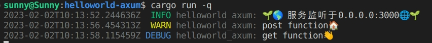

# 日志输出
[TOC]

上一节我们展示了Axum如何简单的建立一个web项目，很方便，但是很简陋。

连基本的后台输出都没有，任何的log信息都没有。

在这一节，我们讲一下如何输出这些信息。

## tracing!
在`helloworld-axum`项目上继续添加`crate`。
```shell
$ cargo add tracing
$ cargo add tracing_subscriber -F "env-filter"
$ cat Cargo.toml
```
```toml
[dependencies]
axum = "0.6"
tokio = { version = "1.25", features = ["full"] }
tracing = "0.1.37"
tracing-subscriber = { version = "0.3.16", features = ["env-filter"] }
#修改一下
[dependencies]
axum = "0.6"
tokio = { version = "1.25", features = ["full"] }
tracing = "0.1"
tracing-subscriber = { version = "0.3", features = ["env-filter"] }
```

修改`src/main.rs`

```rust
use axum::{
    routing::get,
    Router,
};
 
#[tokio::main]
async fn main() {
    if std::env::var_os("RUST_LOG").is_none() {
        std::env::set_var("RUST_LOG", "helloworld_axum=debug");
        //要注意，虽然项目名称是helloworld-axum
        //但是此处要写成helloworld_axum
    }
    tracing_subscriber::fmt::init();
    // 建立一个简单的路由
    let app = Router::new()
            .route("/greet", get(|| async { "Hello, axum World!🌱🌎" }))
            .route("/", get(root))
            .route("/do", get(get_fun).post(post_fun))
            ;
    tracing::info!("🌱🌎 服务监听于{}🌐🌱", "0.0.0.0:3000");
    // 起一个http服务在3000端口
    axum::Server::bind(&"0.0.0.0:3000".parse().unwrap())
        .serve(app.into_make_service())
        .await
        .unwrap();
}
async fn root() -> String {
    String::from("Hello root😀.")
}
async fn get_fun() -> String {
    String::from("get function👋\n")
}
async fn post_fun() -> String {
    String::from("post function🏠\n")
}
```

运行看一下效果


是不是显得专业了很多？

再把之前的函数修改一下：

```rust
use axum::{
    routing::get,
    Router,
};
 
#[tokio::main]
async fn main() {
    if std::env::var_os("RUST_LOG").is_none() {
        std::env::set_var("RUST_LOG", "helloworld_axum=debug");
    }
    tracing_subscriber::fmt::init();
    // 建立一个简单的路由
    let app = Router::new()
            .route("/greet", get(|| async { "Hello, axum World!🌱🌎" }))
            .route("/", get(root))
            .route("/do", get(get_fun).post(post_fun))
            ;
    tracing::info!("🌱🌎 服务监听于{}🌐🌱", "0.0.0.0:3000");
    // 起一个http服务在3000端口
    axum::Server::bind(&"0.0.0.0:3000".parse().unwrap())
        .serve(app.into_make_service())
        .await
        .unwrap();
}
async fn root() -> String {
    tracing::info!("Hello root😀");
    String::from("Hello root😀.")
}
async fn get_fun() -> String {
    tracing::debug!("get function👋");
    String::from("get function👋\n")
}
async fn post_fun() -> String {
    tracing::warn!("post function🏠");
    String::from("post function🏠\n")
}
```



看起来很简单吧，那我们接下来就开始新的挑战吧！
