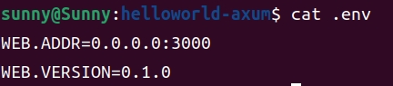
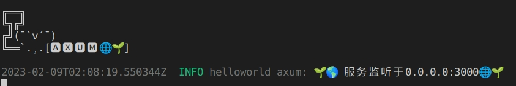

# 配置文件
[TOC]

上一节我们展示了`Axum`如何log输出，也是很轻松。

下面我们来操作一下配置文件。

经常开发web服务的人都知道，基本设置、数据库设置、中间件设置都会放在配置文件里面。

如果，全部`hardcode`在程序里面，灵活性完全没法保证。

成熟的框架都会有配置文件，`Axum`也不例外。

`Axum`与众不同的地方是常用的配置文件使用的是`.env`。这个对于习惯了使用Windows的人来说不是那么友好。

在这里，我再介绍一种使用TOML的方式。

## config!
在`helloworld-axum`项目上继续添加`crate`。
```shell
$ cargo add config 
$ cargo add  serde -F "derive"
$ cargo add dotenv
```
```toml
[dependencies]
config = "0.13.3"
dotenv = "0.15.0"
serde = { version = "1.0.152", features = ["derive"] }
#修改一下
[dependencies]
config = "0.13"
dotenv = "0.15"
serde = { version = "1.0", features = ["derive"] }
```

我们先讲解一下`.env`的方式。首先在根目录里面建一个`.env`文件

```shell
$ touch helloworld-axum/.env
$ echo "WEB.ADDR=0.0.0.0:3000" >> .env
$ echo "WEB.VERSION=0.1.0" >> .env
$ cat .env
```



在`src`目录下增加两个文件`lib.rs`和`config.rs`

`lib.rs`

```rust
pub mod config;
```

`config.rs`

```rust
use serde::Deserialize;
#[derive(Deserialize)]
pub struct WebConfig {
    pub addr: String,
    pub version: String,
}

#[derive(Deserialize)]
pub struct Config {
    pub web: WebConfig,
}
impl Config {
    pub fn from_env() -> Result<Self, config::ConfigError> {
        config::Config::builder()
            .add_source(config::Environment::default())
            .build()?
            .try_deserialize()
    }
}
```


修改`src/main.rs`

```rust
use axum::{
    routing::get,
    Router,
};
use dotenv::dotenv;
use helloworld_axum::config;
#[tokio::main]
async fn main() {
    eprintln!(
r#"
╔══╗
╚╗╔╝
╔╝(¯`v´¯)
╚══`.¸.[🅰 🆇 🆄 🅼 🌐🌱]
"#);
    if std::env::var_os("RUST_LOG").is_none() {
        std::env::set_var("RUST_LOG", "helloworld_axum=debug");
    }
    dotenv().ok();
    tracing_subscriber::fmt::init();
    // 建立一个简单的路由
    let app = Router::new()
            .route("/greet", get(|| async { "Hello, axum World!🌱🌎" }))
            .route("/", get(root))
            .route("/do", get(get_fun).post(post_fun))
            ;
    let cfg = config::Config::from_env().unwrap();
    tracing::info!("🌱🌎 服务监听于{}🌐🌱", &cfg.web.addr);
    // 起一个http服务，端口依靠读取.env文件获得
    axum::Server::bind(&cfg.web.addr.parse().unwrap())
        .serve(app.into_make_service())
        .await
        .unwrap();
}
async fn root() -> String {
    tracing::info!("Hello root😀");
    String::from("Hello root😀.")
}
async fn get_fun() -> String {
    tracing::debug!("get function👋");
    String::from("get function👋\n")
}
async fn post_fun() -> String {
    tracing::warn!("post function🏠");
    String::from("post function🏠\n")
}
```

运行看一下效果


是不是显得专业了很多？

不过这个方式有一个问题，就是在`linux`系统下面会比较方便，但是在windows下就会很麻烦。

我们可以使用`toml`文件来解决这个问题,新建一个`app.toml`文件。

```rust
[web]
    addr="0.0.0.0:3000"
    version="0.1.0"
```

修改一下代码。首先在`config.rs`里面添加一下

```rust
use serde::Deserialize;
#[derive(Deserialize)]
pub struct WebConfig {
    pub addr: String,
    pub version: String,
}

#[derive(Deserialize)]
pub struct Config {
    pub web: WebConfig,
}
impl Config {
    /// 从环境读取
    pub fn from_env() -> Result<Self, config::ConfigError> {
        config::Config::builder()
            .add_source(config::Environment::default())
            .build()?
            .try_deserialize()
    }
    /// 从文件读取
    pub fn from_file(path: &'static str) -> Result<Self, config::ConfigError> {
        config::Config::builder()
        .add_source(config::File::with_name(path))
        .add_source(config::Environment::default())
        .build()?
        .try_deserialize()
    }
}
```

修改一下`main.rs`

只需要更换一行代码，大约在27行。

```rust
// let cfg = config::Config::from_env().unwrap();
let cfg=config::Config::from_file("./app.toml").unwrap();
```



看起来很简单吧，那我们接下来就开始新的挑战吧！
