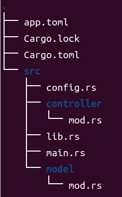
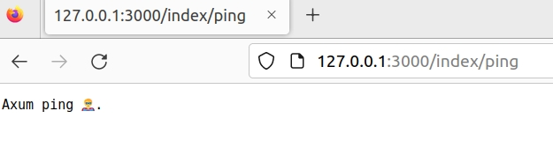
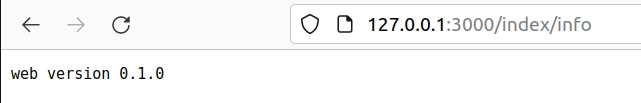

# MVC架构与传输公共参数
[TOC]

上一节我们展示了`Axum`如何使用配置文件，也是很轻松。

下面我们要作一件事情，就是如何使用全局参数，这一点对开发web是很重要的。

经常开发web服务的人都知道，全局变量是必须的，比如数据库的连接池，还有一些全局变量的参数。如果你是在每个请求来的时候临时打开数据库连接，你想象一下那个请求速度会不会很慢？更别说频繁的打开、关闭数据库对数据库的负载也很大。这个是web小白才会犯的错误。

下面就跟着我，走一下正确的道路吧。

## 具体操作


首先修改一下`config.rs`文件

```rust
use serde::Deserialize;
#[derive(Deserialize)]
pub struct WebConfig {
    pub addr: String,
    pub version: String,
}
#[derive(Deserialize)]
pub struct Config {
    pub web: WebConfig,
}
impl Config {
    pub fn from_env() -> Result<Self, config::ConfigError> {
        config::Config::builder()
            .add_source(config::Environment::default())
            .build()?
            .try_deserialize()
    }
}
#[derive(Deserialize,Clone,Debug)]
pub struct WebInfo{
    pub web_addr:String,
    pub web_version:String,
}
```

## MVC架构

这个时候，我们先简单的把MVC的目录架构搭建起来。

```shell
$ mkdir src/controller
$ mkdir src/model
$ touch src/controller/mod.rs
$ touch src/model/mod.rs

$ tree
```




在`controller`目录里面添加一个`index.rs`

```rust
pub async fn ping()-> String{
    String::from("Axum ping 🦸.")
}
```

修改`controller/mod.rs`

```rust
pub mod index;
```

修改`lib.rs`

```rust
pub mod config;
pub mod controller;
pub mod model;
```


修改`src/main.rs`

```rust
use helloworld_axum::{config,controller};

//修改一下路由
let app = Router::new()
            .route("/greet", get(|| async { "Hello, axum World!🌱🌎" }))
            .route("/", get(root))
            .route("/do", get(get_fun).post(post_fun))
            .route("/index/ping", get(controller::index::ping));
```

运行看一下效果



有了这个简单的架构，我们作进一步的拓展，我们把前面的配置信息传输到controller的index里面。具体操作需要很多步：

### 修改`controller/mod.rs`

```rust
use crate::{config::WebInfo};
pub mod index;
#[allow(dead_code)]
fn get_web_info<'a>(state: &'a WebInfo) -> WebInfo{
   state.to_owned()
}
```

### 修改`index.rs`

```rust
use axum::{extract::Path,Extension, };
use crate::{config::WebInfo};
use std::sync::Arc;
use super::{get_web_info,};
pub async fn getwebinfo(
    Extension(info): Extension<Arc<WebInfo>>,
)-> String{
    let info=get_web_info(&info);
    format!("web version {}",info.web_version)
}
pub async fn ping()-> String{
    String::from("Axum ping 🦸.")
}
```

修改一下`main.rs`

```rust
let cfg=config::Config::from_file("./app.toml").unwrap();
let web_info=config::WebInfo{
    web_addr:cfg.web.addr.clone(),
    web_version:cfg.web.version.clone(),
};
// 建立一个简单的路由
let app = Router::new()
        .route("/greet", get(|| async { "Hello, axum World!🌱🌎" }))
        .route("/", get(root))
        .route("/do", get(get_fun).post(post_fun))
        .route("/index/ping", get(controller::index::ping))
        .route("/index/info", get(controller::index::getwebinfo))
        .layer(Extension(Arc::new(web_info))) ;
```

请求一下



有了这个功能以后，传输数据库的全局变量，就很方便了。

前进的脚步不能停，我们下节继续。
