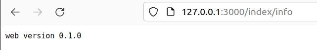

# 高级路由配置文件
[TOC]

我们每次增加一条访问就要写一条路由，就像下面一样:

```rust
let app = Router::new()
    .route("/greet", get(|| async { "Hello, axum World!🌱🌎" }))
    .route("/", get(root))
    .route("/do", get(get_fun).post(post_fun))
    .route("/index/ping", get(controller::index::ping))
    .route("/index/info", get(controller::index::getwebinfo))
```

每增加一个路由就要在`main.rs`里面增加一条，这个很麻烦。

当然你也可以写一个全局的`router.rs`文件来整体的处理这些请求，不过也是要统一管理，这个很不利于大家并行开发，因为使用`cvs`工具，你又是经常大家一起处理同一个文件，难免就会有处理冲突的事情发生。

一般的`MVC`架构都会有一种方式，是在`controller`里面配置路由。

## 在每个`controller`里面配置自己的路由
这个方式需要使用到`tower`,Tower 是一个专注于对网络编程进行抽象的框架，将网络编程中的各行为进行抽象从而提高代码复用率。

在`helloworld-axum`项目上继续添加`crate`。

```shell
$ cargo add tower_http -F "fs,trace"
```
```toml
[dependencies]
tower-http = { version = "0.3.5", features = ["fs", "trace"] }
```

在`index.rs`里面增加一个函数:

```rust
/// 把当前controller里面需要暴露的请求，写成函数
pub(crate) fn index_router() -> Router {
    Router::new()
    .route("/greet", get(greet))
    .route("/info", get(getwebinfo))
    .route("/ping", get(ping))
    .layer(TraceLayer::new_for_http())
}
```

把`main.rs`里面的路由，全部集中到`router.rs`文件中

```rust
use axum::routing::{get};
use crate::controller;

pub fn init() -> axum::Router {
    axum::Router::new()
        .route("/greet", get(|| async { "Hello, axum World!🌱🌎" }))
        .nest("/index", controller::index::index_router())
}
```

修改`lib.rs`

```rust
pub mod config;
pub mod controller;
pub mod model;
pub mod router;
```

修改一下`main.rs`

```rust
use helloworld_axum::{config,controller,router};
use tower_http::{trace::TraceLayer};
async fn main(){
    ……
    let app =  router::init()
            .route("/", get(root))
            .route("/do", get(get_fun).post(post_fun))
            .layer(TraceLayer::new_for_http())
            .layer(Extension(Arc::new(web_info))) ;
    ……
}
```

这个时候请求一下：



很正确，但是看到其中两行，感觉很别扭：

```rust
.route("/", get(root))
.route("/do", get(get_fun).post(post_fun))
```

修改一下`lib.rs`

```rus
pub mod config;
pub mod controller;
pub mod model;
pub mod router;

async fn root() -> String {
    String::from("Hello root😀.")
}
async fn get_fun() -> String {
    String::from("get function👋\n")
}
async fn post_fun() -> String {
    String::from("post function🏠\n")
}
```

修改一下`main.rs`

```rust
async fn main(){
    ……
    let app =  router::init()
            .layer(TraceLayer::new_for_http())
            .layer(Extension(Arc::new(web_info))) ;
    ……
}
```

请求了一下，很完美。不错，我们下节再见。
