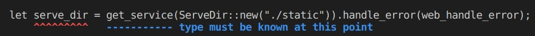
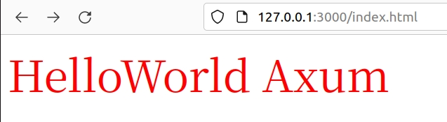
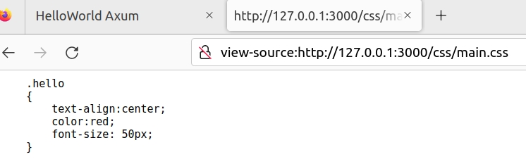

# 处理静态资源

[TOC]

现在网页开发已经越来越趋向于前后分离的开发模式，但是以前开发网页多采用前后端不完全分离的方式，`MVC`方式常常会指定一个静态路径，用于存储`js`、`css`、`images`等。

`Axum`也是支持这种方式，而且很方便。本节我们就来一起设定一下静态路径。

静态资源一般不需要服务端做额外的业务处理，直接透传给浏览器就行，`axum`可以指定将某个目录指定为静态资源。

# 具体操作

```shell
$ mkdir -p static/css
$ mkdir -p static/js
$ mkdir -p static/images
```

修改一下`lib.rs`

```rust
use axum::{
    http::StatusCode,
    response::IntoResponse,
};
use std::{io};
pub async  fn web_handle_error(_err: io::Error) -> impl IntoResponse {
    (StatusCode::INTERNAL_SERVER_ERROR, "Something went wrong...")
}
```


修改一下`router.rs`

> 操作这个一定要注意一定上面写完`let serve_dir = get_service(ServeDir::new("./static")).handle_error(web_handle_error);`
>
> 赶紧在下面添加一行：
>
> `.nest_service("/", serve_dir.clone())`
>
> 不然就会提示有错误
>
> 

```rust
use axum::routing::{get,get_service,};
use crate::controller;
use tower_http::{services::{ServeDir},};
use super::web_handle_error;
pub fn init() -> axum::Router {
    let serve_dir = get_service(ServeDir::new("./static")).handle_error(web_handle_error);
    let css_dir = get_service(ServeDir::new("./static/css")).handle_error(web_handle_error);
    let js_dir = get_service(ServeDir::new("./static/js")).handle_error(web_handle_error);
    let images_dir = get_service(ServeDir::new("./static/images")).handle_error(web_handle_error);
    axum::Router::new()
        .nest_service("/", serve_dir.clone())
        .nest_service("/css", css_dir.clone())
        .nest_service("/js", js_dir.clone())
        .nest_service("/images", images_dir.clone())
        .route("/do", get(crate::get_fun).post(crate::post_fun))
        .route("/greet", get(|| async { "Hello, axum World!🌱🌎" }))
        .nest("/index", controller::index::index_router())
}
```

现在创建几个文件

`static/css/main.css`

```css
.hello
{
    text-align:center;
    color:red;
    font-size: 50px;
}
```


`static/index.html`

```html
<!DOCTYPE html>
<html>
    <head>
        <title>HelloWorld Axum</title>
    </head>
    <link rel="stylesheet" type="text/css" href="/css/main.css" />
    <body>
        <pdiv class="hello">HelloWorld Axum</div>
    </body>
</html>
```

请求一下





这个就有点难度了，主要上面遇到的错误，很不容易找到原因。这个可能等`Axum`再成熟一些，就不会有类似的问题了。

在增加一个图片

