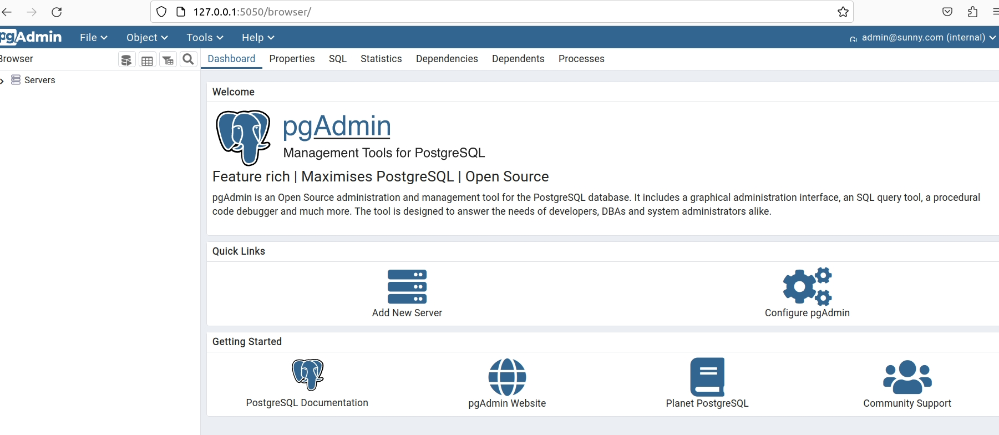

# 数据库准备——`PostgreSQL`
[TOC]

经过前面六节的操作，我们对Axum有了基本的认识，现在我就要操作更高级的功能数据库操作。

因为`web`服务大部分还是要有数据操作，所以操作数据库是必须的。


## docker 安装`PostgreSQL`
## 安装`docker`在`ubuntu`下

```shell
$ sudo apt install docker
$ sudo apt  install docker.io
```
## 安装`PostgreSQL`
```shell
$  sudo docker pull postgres:13
$ sudo docker images
REPOSITORY   TAG       IMAGE ID       CREATED      SIZE
postgres     13        6a3d8bd95dca   2 days ago   374MB
```
## `docker`启动`PostgreSQL`,并把数据库挂出来

```shell
$  docker run -it -d --name postgresql -v /home/sunny/work/opt/dbs/pg:/var/lib/postgresql/data  -p 5432:5432 -e POSTGRES_PASSWORD=postgres postgres:13

$ docker exec -it postgres /bin/bash
```
## 创建数据库用户
```shell
# su - postgres
$ createuser --interactive sa -P
Enter password for new role: 
Enter it again: 
Shall the new role be a superuser? (y/n) y

///密码我输入的是123456
```
## 创建数据库
```shell
$ createdb helloworld -O sa -E UTF-8
$ exit
# psql -U postgres
# \l
                                List of databases
    Name    |  Owner   | Encoding |  Collate   |   Ctype    |   Access privileges   
------------+----------+----------+------------+------------+-----------------------
 helloworld | sa       | UTF8     | en_US.utf8 | en_US.utf8 | 
 postgres   | postgres | UTF8     | en_US.utf8 | en_US.utf8 | 
 template0  | postgres | UTF8     | en_US.utf8 | en_US.utf8 | =c/postgres          +
            |          |          |            |            | postgres=CTc/postgres
 template1  | postgres | UTF8     | en_US.utf8 | en_US.utf8 | =c/postgres          +
            |          |          |            |            | postgres=CTc/postgres
(4 rows)
```

看到上面的表格，说明我们已经成功的创建了`helloworld`这个数据库。查看一下这个数据库的大小

```shell
# select pg_database_size('helloworld');
 pg_database_size 
------------------
          7938563
(1 row)
# select pg_size_pretty(pg_database_size('helloworld'));
 pg_size_pretty 
----------------
 7753 kB
(1 row)
# select pg_database.datname, pg_size_pretty(pg_database_size(pg_database.datname)) AS size from pg_database;
  datname   |  size   
------------+---------
 postgres   | 7901 kB
 template1  | 7753 kB
 template0  | 7753 kB
 helloworld | 7753 kB
(4 rows)
```

## `docker`安装`pgadmin`

```shell
$ mkdir -p dbs/pgadmin/data
$ mkdir -p dbs/pgadmin/logs
$ chmod 777 dbs/pgadmin/data
$ chmod 777 dbs/pgadmin/logs
$ sudo -i
# docker pull dpage/pgadmin4

# docker run -d -p 5050:80 --name pgadmin4 -e "PGADMIN_DEFAULT_EMAIL=admin@sunny.com" -e "PGADMIN_DEFAULT_PASSWORD=123456" -v /home/sunny/work/opt/dbs/pgadmin/data:/var/lib/pgadmin -v /home/sunny/work/opt/dbs/pgadmin/logs:/var/log/pgadmin  dpage/pgadmin4
```

使用浏览器请求一下



## 创建数据表

接下来我们创建一个数据表，我们这次使用一个简单的表结构，但是将来的操作却会比较复杂。这个数据表格是记录标签的，这个标签是递归性质的，最后以树状形式展现。

`Tag`

| 名称   | 类型   | 是否必填 | 说明   |
| ------ | ------ | -------- | ------ |
| `id`   | int    | 是       | 自增id |
| `name` | string | 是       | 名称   |
| `pid`  | int    | 是       | 父id   |


下面我们来创建这个表,也可以使用语句创建：
```shell
# psql -h 127.0.0.1 -p 5432 -U sa helloworld
# CREATE schema sunny_rbac;
# \dn
   List of schemas
    Name    |  Owner   
------------+----------
 public     | postgres
 sunny_rbac | sa
(2 rows)
# CREATE TABLE sunny_rbac.tag( id serial PRIMARY KEY     NOT NULL,name           VARCHAR(50)    NOT NULL,pid  INT     NOT NULL);
# \d sunny_rbac.tag;
                                       Table "sunny_rbac.tag"
 Column |         Type          | Collation | Nullable |                  Default                   
--------+-----------------------+-----------+----------+--------------------------------------------
 id     | integer               |           | not null | nextval('sunny_rbac.tag_id_seq'::regclass)
 name   | character varying(50) |           | not null | 
 pid    | integer               |           | not null | 
Indexes:
    "tag_pkey" PRIMARY KEY, btree (id)
```

```shell
# insert into sunny_rbac.tag(id,name,pid) values(0,'root',0);
# insert into sunny_rbac.tag(name,pid) values('文字',0);
# insert into sunny_rbac.tag(name,pid) values('QA',1),('FAQ',1);
# insert into sunny_rbac.tag(name,pid) values('音频',0);
# insert into sunny_rbac.tag(name,pid) values('歌曲',4),('戏曲',4),('音乐',4);
# insert into sunny_rbac.tag(name,pid) values('民乐',7),('轻音乐',7),('交响乐',7),('电子音乐',7);
# select * from sunny_rbac.tag;
 id |   name   | pid 
----+----------+-----
  0 | root     |   0
  1 | 文字     |   0
  2 | QA       |   1
  3 | FAQ      |   1
  4 | 音频     |   0
  5 | 歌曲     |   4
  6 | 戏曲     |   4
  7 | 音乐     |   4
  8 | 民乐     |   7
  9 | 轻音乐   |   7
 10 | 交响乐   |   7
 11 | 电子音乐 |   7
(12 rows)
```

OK,现在基本的准备工作都做好了。

在下一节，我们通过`auxm`来连接数据库。