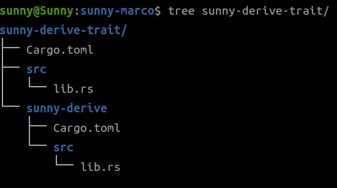

# 过程宏

[TOC]

从这一章节开始我们要实操一个过程宏，简单的`marco`教程，网上一抓一大把。大家有兴趣自己去查看。我这里讲的是我实际工作中要用的干货。我会在这一章节带领大家，做一个使用`marco`制作的`PostgreSQL`的`CURD`的例子。


## 准备工作

首先我们把上一章用到的例子复制到这一章，我们在那个的基础上完成新的功能。

```shell
$ cp helloworld-axum/ sunny-marco -rf
```

修改一下`Cargo.toml`

```toml
[package]
name = "sunny-marco"
version = "0.1.0"
edition = "2021"

# See more keys and their definitions at https://doc.rust-lang.org/cargo/reference/manifest.html

[dependencies]
askama = "0.11"
async-trait = "0.1.66"
axum = "0.6"
config = "0.13"
dotenv = "0.15"
redis = { version = "0.22.3", features = ["tokio-comp", "cluster", "json"] }
serde = { version = "1.0", features = ["derive"] }
serde_json = "1.0.93"
sqlx = { version = "0.6", features = ["runtime-tokio-native-tls", "postgres"] }
tokio = { version = "1.25", features = ["full"] }
tower-http = { version = "0.3.5", features = ["fs", "trace"] }
tracing = "0.1.37"
tracing-subscriber = { version = "0.3", features = ["env-filter"] }
```

```shell
$ cargo-watch watch -c -w templates/ -w src -x run
$ vim src/main.rs +8
```
把`main.rs`的第八行修改成下面的样子：
```rust
use sunny_marco::{config,router, dbstate};
```


运行一切正常！

## 准备数据表

```sql
CREATE TABLE storyboard.emotion( id serial PRIMARY KEY     NOT NULL,name           VARCHAR(50)    NOT NULL,code  VARCHAR(50)    NOT NULL,unicode CHAR(10)    NOT NULL) ;

insert into storyboard.emotion(name,code,unicode) values('微微的笑脸','slightly-smiling-face','1F642');

insert into storyboard.emotion(name,code,unicode) values('大眼笑脸','grinning-face-with-big-eyes','1F603');  
```


## 创建`macro`需要的环境

```shell
$ cd sunny-marco
$ cargo new sunny-derive-trait --lib
$ cd sunny-derive-trait
$ cd sunny-derive
```

做完了目录结构如下：



> 说明一下，因为我们使用的是Procedural Macros (Derive Macro)这个技术，在各种文档当中讲解这个都不是很全。我也是找了整整一周才了解了一种解决方案。


## 开始写`sunny-derive`

修改`Cargo.toml`

```toml
[lib]
proc-macro = true

[dependencies]
syn = { version = "1.0", features = ["full"] }
quote = "1.0"
serde_json = "1.0.95"
proc-macro2 = "1.0.56"
```

修改`lib.rs`

```rust
use proc_macro::{self, Ident, TokenStream};
use syn::{
    parse::{Parse, ParseStream},
    parse_macro_input, parse_quote,
    spanned::Spanned,
    token::Token,
    Data::Struct,
    DataEnum, DataStruct, DataUnion, DeriveInput,
    Fields::Named,
    FieldsNamed, FieldsUnnamed,
};

use quote::{quote, ToTokens};
#[proc_macro_derive(PgCurdStruct, attributes(TableName))]
pub fn derive_signature(item: TokenStream) -> TokenStream {
    let ast = parse_macro_input!(item as DeriveInput);
    let struct_name = &ast.ident;
    let attrs = &ast.attrs;
    let mut table_name: Option<String> = None;

    for attr in attrs {
        match attr.parse_meta().unwrap() {
            syn::Meta::NameValue(val) => {
                if val.path.is_ident("TableName") {
                    if let syn::Lit::Str(lit) = &val.lit {
                        table_name = Some(lit.value());
                    }
                }
            }
            _ => (),
        }
    }

    let table_name = table_name.expect("TableName attr not found");
    let fields = if let syn::Data::Struct(syn::DataStruct {
        fields: syn::Fields::Named(ref fields),
        ..
    }) = ast.data
    {
        fields
    } else {
        panic!("Only support Struct")
    };

    let mut keys = Vec::new();
    let mut idents = Vec::new();
    let mut types = Vec::new();

    for field in fields.named.iter() {
        let field_name: &syn::Ident = field.ident.as_ref().unwrap();
        let name: String = field_name.to_string();
        let literal_key_str = syn::LitStr::new(&name, field.span());
        let type_name = &field.ty;
        keys.push(quote! { #literal_key_str });
        idents.push(&field.ident);
        types.push(type_name.to_token_stream());
    }

    let expanded = quote! {
        impl PgCurdStruct for #struct_name {
            fn print(&self) {
                #(
                    println!(
                        "key={key}, value={value}, type={type_name},INSERT INTO {table_name}",
                        key = #keys,
                        value = self.#idents,
                        type_name = stringify!(#types),
                        table_name = #table_name
                    );
                )*
            }
        }
    };
    expanded.into()
}
```

## 创建测试例子

`Cargo.toml`主程序里面添加下面两行：

```toml
[dependencies]
sunny-derive-trait = { path = "sunny-derive-trait" }
sunny-derive = { path = "sunny-derive-trait/sunny-derive" }
```

`model/emotion.rs`

```rust
use redis::{Commands, };
use serde::{Deserialize, Serialize};
use super::{get_conn, get_redis_conn};
use crate::{AppError,dbstate::DbState,Result};
use sunny_derive_trait::*;
use sunny_derive::*;

#[derive(Debug, Clone, PartialEq, Serialize, Deserialize, PgCurdStruct)]
#[TableName = "storyboard.emotion"]
pub struct Model {
    pub id: i32,
    pub name: String,
    pub code: String,
    pub unicode: String,
}
```

此处已经把`macro`添加在`struct`上方

```rust
#[derive(……, PgCurdStruct)]  //使用macro
#[TableName = "storyboard.emotion"]  //输入TableName
```

`controller/emotion.rs`

```rust
use super::render;
use crate::{dbstate::*, model::emotion::*, model::*, util::stack::*, util::types::*, util::*};
use askama::Template;
use axum::{
    extract::Path,
    http::{header::HeaderName, HeaderMap, HeaderValue,  StatusCode},
    routing::{get, post},
    Extension, Form, Json, Router,
};
use serde::Deserialize;
use std::collections::HashMap;
use std::sync::Arc;
use tower_http::trace::TraceLayer;
use sunny_derive_trait::PgCurdStruct; //这句非常重要，没有这一句，汇报错
pub(crate) fn index_router() -> Router {
    Router::new()
        .route("/test", get(test))
        .layer(TraceLayer::new_for_http())
}

async fn test() -> String {
    eprint!("----------");
    let emo=emotion::Model{id:0,name:"name".to_string(),code:"10086".to_string(),unicode:"1F001".to_string()};
    emo.print();
    String::from("Hello root😀.")
}
```

麻烦在各自的`mod.rs`里面添加上相应的语句

`route.rs`里面加上一句

```rust
```

